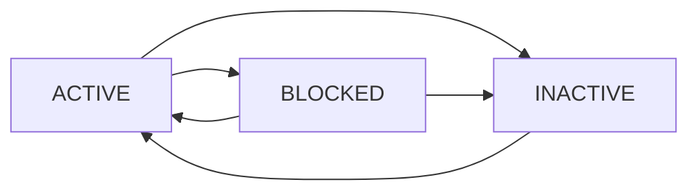

# Customer API Documentation

The Customer API manages Thai customers with LINE OA integration for the Tinedy CRM system.

## Table of Contents

- [Overview](#overview)
- [Endpoints](#endpoints)
- [Data Models](#data-models)
- [Examples](#examples)
- [Business Rules](#business-rules)
- [Error Handling](#error-handling)

## Overview

The Customer API handles:
- Thai customer information with native Thai name support
- LINE User ID integration for LINE OA customers
- Thai phone number validation and formatting
- Customer status management (Active, Inactive, Blocked)
- Relationship with jobs and service history

### Key Features

- **Thai Names**: Full support for Thai characters and titles
- **Phone Numbers**: Automatic formatting for Thai phone numbers
- **LINE Integration**: Direct integration with LINE Official Account
- **Search**: Thai text search with intelligent matching
- **Validation**: Comprehensive validation for Thai business context

## Endpoints

### List Customers

```http
GET /api/customers
```

Retrieve a paginated list of customers with optional filtering and search.

#### Query Parameters

| Parameter | Type | Description | Example |
|-----------|------|-------------|---------|
| `page` | integer | Page number (default: 1) | `?page=2` |
| `limit` | integer | Items per page (default: 20, max: 100) | `?limit=50` |
| `search` | string | Search in name, phone, email | `?search=สมชาย` |
| `status` | string | Filter by status | `?status=ACTIVE` |
| `lineUserId` | string | Find by LINE User ID | `?lineUserId=U1234...` |
| `sortBy` | string | Sort field | `?sortBy=name` |
| `sortOrder` | string | Sort direction (asc/desc) | `?sortOrder=desc` |
| `include` | string | Include related data | `?include=jobs,jobsCount` |

#### Response

```json
{
  "data": [
    {
      "id": "clr123abc456def789",
      "name": "สมชาย ใจดี",
      "phone": "+66812345678",
      "email": "somchai@example.com",
      "address": "123 ถนนสุขุมวิท กรุงเทพฯ 10110",
      "lineUserId": "Uab1234567890abcdef1234567890abcdef",
      "status": "ACTIVE",
      "notes": "ลูกค้าประจำ",
      "createdAt": "2024-01-15T08:30:00Z",
      "updatedAt": "2024-01-15T08:30:00Z",
      "jobsCount": 5
    }
  ],
  "pagination": {
    "page": 1,
    "limit": 20,
    "total": 150,
    "pages": 8,
    "hasNext": true,
    "hasPrev": false
  }
}
```

#### Authorization
- **Required**: Authenticated user
- **Roles**: All roles can list customers
- **Permissions**: Operations and above can see full details

---

### Get Customer

```http
GET /api/customers/{id}
```

Retrieve a specific customer by ID.

#### Path Parameters

| Parameter | Type | Description |
|-----------|------|-------------|
| `id` | string | Customer ID (CUID) |

#### Query Parameters

| Parameter | Type | Description | Example |
|-----------|------|-------------|---------|
| `include` | string | Include related data | `?include=jobs,qualityChecks` |

#### Response

```json
{
  "id": "clr123abc456def789",
  "name": "สมชาย ใจดี",
  "phone": "+66812345678",
  "email": "somchai@example.com",
  "address": "123 ถนนสุขุมวิท แขวงคลองตัน เขตคลองเตย กรุงเทพฯ 10110",
  "lineUserId": "Uab1234567890abcdef1234567890abcdef",
  "status": "ACTIVE",
  "notes": "ลูกค้าประจำ บริการดี",
  "createdAt": "2024-01-15T08:30:00Z",
  "updatedAt": "2024-01-15T08:30:00Z",
  "jobs": [
    {
      "id": "clr789xyz123abc456",
      "serviceType": "บริการทำความสะอาด",
      "status": "COMPLETED",
      "scheduledAt": "2024-01-20T09:00:00Z",
      "completedAt": "2024-01-20T12:00:00Z"
    }
  ],
  "jobsCount": 5,
  "lastJobDate": "2024-01-20T12:00:00Z"
}
```

#### Authorization
- **Required**: Authenticated user
- **Roles**: All roles can view customer details

---

### Create Customer

```http
POST /api/customers
```

Create a new customer.

#### Request Body

```json
{
  "name": "สมชาย ใจดี",
  "phone": "+66812345678",
  "email": "somchai@example.com",
  "address": "123 ถนนสุขุมวิท แขวงคลองตัน เขตคลองเตย กรุงเทพฯ 10110",
  "lineUserId": "Uab1234567890abcdef1234567890abcdef",
  "notes": "ลูกค้าใหม่จาก LINE OA"
}
```

#### Validation Rules

| Field | Required | Validation |
|-------|----------|------------|
| `name` | ✅ Yes | 2-100 characters, Thai/English/spaces/dots only |
| `phone` | ❌ No | Thai phone number format |
| `email` | ❌ No | Valid email format |
| `address` | ❌ No | Max 500 characters |
| `lineUserId` | ❌ No | LINE User ID format (U + 32 hex chars) |
| `notes` | ❌ No | Max 1000 characters |

#### Response

```json
{
  "id": "clr123abc456def789",
  "name": "สมชาย ใจดี",
  "phone": "+66812345678",
  "email": "somchai@example.com",
  "address": "123 ถนนสุขุมวิท แขวงคลองตัน เขตคลองเตย กรุงเทพฯ 10110",
  "lineUserId": "Uab1234567890abcdef1234567890abcdef",
  "status": "ACTIVE",
  "notes": "ลูกค้าใหม่จาก LINE OA",
  "createdAt": "2024-01-15T08:30:00Z",
  "updatedAt": "2024-01-15T08:30:00Z"
}
```

#### Authorization
- **Required**: Authenticated user
- **Roles**: ADMIN, OPERATIONS
- **Permissions**: Can create customers

---

### Update Customer

```http
PUT /api/customers/{id}
```

Update an existing customer.

#### Path Parameters

| Parameter | Type | Description |
|-----------|------|-------------|
| `id` | string | Customer ID (CUID) |

#### Request Body

```json
{
  "name": "สมชาย ใจดี (แก้ไข)",
  "phone": "+66898765432",
  "email": "somchai.new@example.com",
  "address": "456 ถนนพระราม 4 แขวงสีลม เขตบางรัก กรุงเทพฯ 10500",
  "status": "INACTIVE",
  "notes": "ลูกค้าย้ายที่อยู่"
}
```

#### Validation Rules

Same as create, but all fields are optional. Only provided fields will be updated.

#### Response

```json
{
  "id": "clr123abc456def789",
  "name": "สมชาย ใจดี (แก้ไข)",
  "phone": "+66898765432",
  "email": "somchai.new@example.com",
  "address": "456 ถนนพระราม 4 แขวงสีลม เขตบางรัก กรุงเทพฯ 10500",
  "lineUserId": "Uab1234567890abcdef1234567890abcdef",
  "status": "INACTIVE",
  "notes": "ลูกค้าย้ายที่อยู่",
  "createdAt": "2024-01-15T08:30:00Z",
  "updatedAt": "2024-01-16T10:45:00Z"
}
```

#### Authorization
- **Required**: Authenticated user
- **Roles**: ADMIN, OPERATIONS
- **Permissions**: Can update customers

---

### Delete Customer

```http
DELETE /api/customers/{id}
```

Delete a customer (soft delete - changes status to deleted).

#### Path Parameters

| Parameter | Type | Description |
|-----------|------|-------------|
| `id` | string | Customer ID (CUID) |

#### Response

```http
HTTP/1.1 204 No Content
```

#### Business Rules

- Cannot delete customer with active jobs
- Cannot delete customer with pending quality checks
- Deletion is soft delete (status changes to DELETED)

#### Authorization
- **Required**: Authenticated user
- **Roles**: ADMIN only
- **Permissions**: Can delete customers

---

### Find Customer by LINE User ID

```http
GET /api/customers/line/{lineUserId}
```

Find a customer by their LINE User ID (used for LINE OA integration).

#### Path Parameters

| Parameter | Type | Description |
|-----------|------|-------------|
| `lineUserId` | string | LINE User ID |

#### Response

```json
{
  "id": "clr123abc456def789",
  "name": "สมชาย ใจดี",
  "phone": "+66812345678",
  "email": "somchai@example.com",
  "lineUserId": "Uab1234567890abcdef1234567890abcdef",
  "status": "ACTIVE",
  "lastInteraction": "2024-01-15T08:30:00Z"
}
```

#### Authorization
- **Required**: API Key (for webhook integration)
- **Roles**: System integration only

## Data Models

### Customer Object

```typescript
interface Customer {
  id: string;                    // CUID format
  name: string;                  // Thai/English name
  phone?: string;                // Thai phone number (+66...)
  email?: string;                // Email address
  address?: string;              // Thai address
  lineUserId?: string;           // LINE User ID (U + 32 hex)
  status: CustomerStatus;        // ACTIVE | INACTIVE | BLOCKED
  notes?: string;                // Additional notes
  createdAt: string;             // ISO 8601 timestamp
  updatedAt: string;             // ISO 8601 timestamp

  // Computed fields (when included)
  jobs?: Job[];                  // Related jobs
  jobsCount?: number;            // Total number of jobs
  lastJobDate?: string;          // Last job completion date
}
```

### Customer Status

```typescript
enum CustomerStatus {
  ACTIVE = "ACTIVE",       // Can receive new jobs
  INACTIVE = "INACTIVE",   // No new jobs, but can view history
  BLOCKED = "BLOCKED"      // Blocked from system
}
```

### Thai Phone Number Format

Phone numbers are automatically converted to international format:

```javascript
// Input formats
"0812345678"     → "+66812345678"
"081-234-5678"   → "+66812345678"
"(66)812345678"  → "+66812345678"
"+66812345678"   → "+66812345678" (no change)

// Valid patterns
Mobile:   "+66[8-9]XXXXXXXX"
Landline: "+66[2-7]XXXXXXX"
```

## Examples

### Search Customers by Thai Name

```http
GET /api/customers?search=สมชาย&limit=10

Response:
{
  "data": [
    {
      "id": "clr123abc456def789",
      "name": "สมชาย ใจดี",
      "phone": "+66812345678",
      "status": "ACTIVE"
    },
    {
      "id": "clr456def789abc123",
      "name": "สมชายรัก ดีใจ",
      "phone": "+66898765432",
      "status": "ACTIVE"
    }
  ],
  "pagination": {
    "total": 2,
    "page": 1,
    "limit": 10
  }
}
```

### Create Customer from LINE OA

```http
POST /api/customers
Content-Type: application/json

{
  "name": "ลูกค้าจาก LINE",
  "lineUserId": "Uab1234567890abcdef1234567890abcdef",
  "notes": "สร้างจากการติดต่อผ่าน LINE OA"
}

Response:
{
  "id": "clr789abc123def456",
  "name": "ลูกค้าจาก LINE",
  "lineUserId": "Uab1234567890abcdef1234567890abcdef",
  "status": "ACTIVE",
  "notes": "สร้างจากการติดต่อผ่าน LINE OA",
  "createdAt": "2024-01-15T08:30:00Z",
  "updatedAt": "2024-01-15T08:30:00Z"
}
```

### Update Customer Status

```http
PUT /api/customers/clr123abc456def789
Content-Type: application/json

{
  "status": "BLOCKED",
  "notes": "ลูกค้าไม่ชำระเงิน"
}

Response:
{
  "id": "clr123abc456def789",
  "name": "สมชาย ใจดี",
  "status": "BLOCKED",
  "notes": "ลูกค้าไม่ชำระเงิน",
  "updatedAt": "2024-01-16T10:45:00Z"
}
```

### Get Customer with Jobs

```http
GET /api/customers/clr123abc456def789?include=jobs

Response:
{
  "id": "clr123abc456def789",
  "name": "สมชาย ใจดี",
  "phone": "+66812345678",
  "status": "ACTIVE",
  "jobs": [
    {
      "id": "clr789xyz123abc456",
      "serviceType": "บริการทำความสะอาด",
      "status": "COMPLETED",
      "scheduledAt": "2024-01-20T09:00:00Z",
      "completedAt": "2024-01-20T12:00:00Z"
    },
    {
      "id": "clr456def789xyz123",
      "serviceType": "บริการฝึกอบรม",
      "status": "IN_PROGRESS",
      "scheduledAt": "2024-01-25T10:00:00Z"
    }
  ],
  "jobsCount": 2
}
```

## Business Rules

### Customer Status Transitions



### Validation Rules

1. **Name Validation**
   - Must contain at least 2 characters
   - Supports Thai characters (ก-๙), English (A-z), spaces, and dots
   - No special characters or numbers
   - No HTML/script tags

2. **Phone Validation**
   - Must be valid Thai phone number
   - Automatically converts to international format
   - Supports mobile (08x, 09x) and landline formats

3. **LINE User ID Validation**
   - Must start with 'U' followed by exactly 32 hexadecimal characters
   - Must be unique across all customers
   - Case-sensitive validation

4. **Email Validation**
   - Standard email format validation
   - Supports international domain names
   - Not required but must be valid if provided

### Business Constraints

1. **LINE User ID Uniqueness**
   - Each LINE User ID can only be associated with one customer
   - Attempting to create duplicate will return 409 Conflict

2. **Customer Deletion**
   - Cannot delete customer with active jobs (status: NEW, IN_PROGRESS)
   - Cannot delete customer with pending quality checks
   - Deletion is soft delete (status changes to DELETED)

3. **Job Relationships**
   - Customer must exist before creating jobs
   - Customer with jobs cannot be hard deleted
   - Inactive customers can still view job history

## Error Handling

### Common Error Responses

#### 400 Bad Request - Validation Error

```json
{
  "error": "Validation failed",
  "errorTh": "ข้อมูลไม่ถูกต้อง",
  "code": "VALIDATION_ERROR",
  "timestamp": "2024-01-15T10:30:00Z",
  "details": [
    {
      "field": "phone",
      "message": "Phone number must be in valid Thai format",
      "messageTh": "หมายเลขโทรศัพท์ต้องเป็นรูปแบบไทยที่ถูกต้อง",
      "value": "invalid-phone"
    },
    {
      "field": "lineUserId",
      "message": "LINE User ID must start with U followed by 32 hex characters",
      "messageTh": "LINE User ID ต้องขึ้นต้นด้วย U ตามด้วยตัวเลข 16 ฐาน 32 ตัว"
    }
  ]
}
```

#### 409 Conflict - Duplicate LINE User ID

```json
{
  "error": "LINE User ID already exists",
  "errorTh": "LINE User ID นี้มีอยู่ในระบบแล้ว",
  "code": "DUPLICATE_LINE_USER_ID",
  "timestamp": "2024-01-15T10:30:00Z",
  "details": {
    "lineUserId": "Uab1234567890abcdef1234567890abcdef",
    "existingCustomerId": "clr456def789abc123"
  }
}
```

#### 422 Unprocessable Entity - Business Rule Violation

```json
{
  "error": "Cannot delete customer with active jobs",
  "errorTh": "ไม่สามารถลบลูกค้าที่มีงานที่ยังไม่เสร็จสิ้น",
  "code": "CUSTOMER_HAS_ACTIVE_JOBS",
  "timestamp": "2024-01-15T10:30:00Z",
  "details": {
    "customerId": "clr123abc456def789",
    "activeJobsCount": 3,
    "activeJobs": [
      {
        "id": "clr789xyz123abc456",
        "status": "IN_PROGRESS",
        "serviceType": "บริการทำความสะอาด"
      }
    ]
  }
}
```

### Error Codes Reference

| Code | HTTP Status | Description |
|------|-------------|-------------|
| `VALIDATION_ERROR` | 400 | Input validation failed |
| `CUSTOMER_NOT_FOUND` | 404 | Customer ID not found |
| `DUPLICATE_LINE_USER_ID` | 409 | LINE User ID already exists |
| `DUPLICATE_EMAIL` | 409 | Email already exists |
| `INVALID_THAI_PHONE` | 400 | Phone number not in Thai format |
| `INVALID_LINE_USER_ID` | 400 | LINE User ID format invalid |
| `CUSTOMER_HAS_ACTIVE_JOBS` | 422 | Cannot delete customer with active jobs |
| `INSUFFICIENT_PERMISSIONS` | 403 | User role doesn't allow operation |