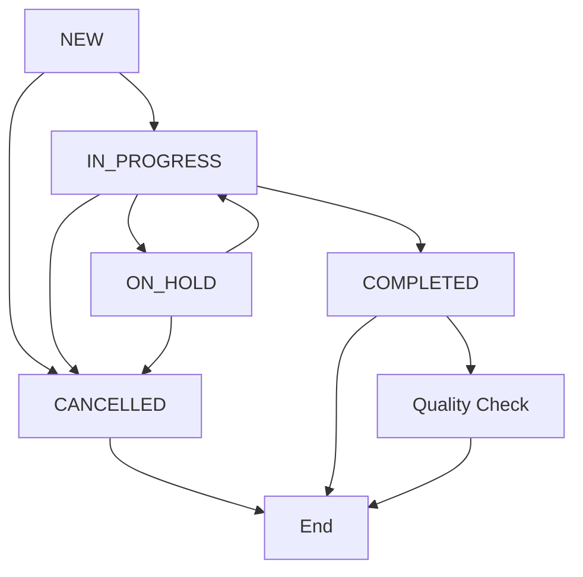

# Job API Documentation

The Job API manages service bookings and job workflows for the Tinedy CRM system.

## Table of Contents

- [Overview](#overview)
- [Endpoints](#endpoints)
- [Data Models](#data-models)
- [Examples](#examples)
- [Workflow Management](#workflow-management)
- [Business Rules](#business-rules)
- [Error Handling](#error-handling)

## Overview

The Job API handles:
- Service booking management
- Job status workflow (NEW → IN_PROGRESS → COMPLETED)
- Assignment to operations team members
- Priority management and scheduling
- Quality control integration
- N8N workflow integration with webhook data

### Key Features

- **Thai Service Types**: Support for Thai service descriptions
- **Status Workflow**: Enforced status transitions
- **Assignment System**: Role-based job assignment
- **Priority Management**: LOW, MEDIUM, HIGH, URGENT priorities
- **Quality Integration**: Automatic quality check creation
- **Webhook Integration**: Store N8N workflow data with jobs

## Endpoints

### List Jobs

```http
GET /api/jobs
```

Retrieve a paginated list of jobs with filtering and search capabilities.

#### Query Parameters

| Parameter | Type | Description | Example |
|-----------|------|-------------|---------|
| `page` | integer | Page number (default: 1) | `?page=2` |
| `limit` | integer | Items per page (default: 20, max: 100) | `?limit=50` |
| `search` | string | Search in service type, description | `?search=ทำความสะอาด` |
| `status` | string | Filter by job status | `?status=IN_PROGRESS` |
| `priority` | string | Filter by priority | `?priority=HIGH` |
| `customerId` | string | Filter by customer ID | `?customerId=clr123...` |
| `assignedToId` | string | Filter by assigned user ID | `?assignedToId=clr456...` |
| `sortBy` | string | Sort field | `?sortBy=priority,createdAt` |
| `sortOrder` | string | Sort direction (asc/desc) | `?sortOrder=desc` |
| `include` | string | Include related data | `?include=customer,assignedTo` |
| `scheduledFrom` | string | Filter by scheduled date from | `?scheduledFrom=2024-01-20` |
| `scheduledTo` | string | Filter by scheduled date to | `?scheduledTo=2024-01-25` |

#### Response

```json
{
  "data": [
    {
      "id": "clr789xyz123abc456",
      "customerId": "clr123abc456def789",
      "serviceType": "บริการทำความสะอาด",
      "description": "ทำความสะอาดออฟฟิศ ชั้น 15",
      "status": "IN_PROGRESS",
      "priority": "HIGH",
      "assignedToId": "clr456def789abc123",
      "scheduledAt": "2024-01-20T09:00:00Z",
      "estimatedDuration": 180,
      "notes": "ต้องใช้อุปกรณ์พิเศษ",
      "createdAt": "2024-01-15T08:30:00Z",
      "updatedAt": "2024-01-18T10:15:00Z",
      "customer": {
        "id": "clr123abc456def789",
        "name": "สมชาย ใจดี",
        "phone": "+66812345678"
      },
      "assignedTo": {
        "id": "clr456def789abc123",
        "name": "สมหญิง ทำงาน",
        "role": "OPERATIONS"
      }
    }
  ],
  "pagination": {
    "page": 1,
    "limit": 20,
    "total": 85,
    "pages": 5,
    "hasNext": true,
    "hasPrev": false
  }
}
```

#### Authorization
- **Required**: Authenticated user
- **Roles**: All roles can list jobs (filtered by permissions)
- **Permissions**: Operations see assigned jobs, Admin/QC see all

---

### Get Job

```http
GET /api/jobs/{id}
```

Retrieve a specific job by ID with full details.

#### Path Parameters

| Parameter | Type | Description |
|-----------|------|-------------|
| `id` | string | Job ID (CUID) |

#### Query Parameters

| Parameter | Type | Description | Example |
|-----------|------|-------------|---------|
| `include` | string | Include related data | `?include=customer,assignedTo,qualityChecks` |

#### Response

```json
{
  "id": "clr789xyz123abc456",
  "customerId": "clr123abc456def789",
  "serviceType": "บริการทำความสะอาด",
  "description": "ทำความสะอาดออฟฟิศ ชั้น 15 ครบวงจร",
  "status": "IN_PROGRESS",
  "priority": "HIGH",
  "assignedToId": "clr456def789abc123",
  "scheduledAt": "2024-01-20T09:00:00Z",
  "startedAt": "2024-01-20T09:15:00Z",
  "estimatedDuration": 180,
  "actualDuration": null,
  "completedAt": null,
  "notes": "ต้องใช้อุปกรณ์พิเศษ ลูกค้าขอทำเสร็จก่อน 12:00",
  "internalNotes": "ทีมงานต้องเตรียมอุปกรณ์ล่วงหน้า",
  "webhookData": {
    "n8nExecutionId": "exec-12345",
    "sourceWorkflow": "line-booking",
    "originalPayload": {
      "lineMessage": "ต้องการจองบริการทำความสะอาด"
    }
  },
  "n8nWorkflowId": "workflow-booking-123",
  "createdAt": "2024-01-15T08:30:00Z",
  "updatedAt": "2024-01-20T09:15:00Z",
  "customer": {
    "id": "clr123abc456def789",
    "name": "สมชาย ใจดี",
    "phone": "+66812345678",
    "lineUserId": "Uab1234567890abcdef1234567890abcdef"
  },
  "assignedTo": {
    "id": "clr456def789abc123",
    "name": "สมหญิง ทำงาน",
    "role": "OPERATIONS",
    "phone": "+66898765432"
  },
  "qualityChecks": [
    {
      "id": "clr321cba654fed987",
      "checklistId": "clr111aaa222bbb333",
      "status": "PENDING",
      "checklistName": "มาตรฐานการทำความสะอาด"
    }
  ]
}
```

#### Authorization
- **Required**: Authenticated user
- **Roles**: All roles can view job details
- **Permissions**: Operations see assigned jobs, others see all

---

### Create Job

```http
POST /api/jobs
```

Create a new job (booking).

#### Request Body

```json
{
  "customerId": "clr123abc456def789",
  "serviceType": "บริการทำความสะอาด",
  "description": "ทำความสะอาดออฟฟิศ ชั้น 15",
  "priority": "MEDIUM",
  "scheduledAt": "2024-01-20T09:00:00Z",
  "estimatedDuration": 180,
  "notes": "ลูกค้าขอทำเสร็จก่อน 12:00",
  "assignedToId": "clr456def789abc123",
  "webhookData": {
    "n8nExecutionId": "exec-12345",
    "sourceWorkflow": "line-booking",
    "originalPayload": {
      "customer": {
        "lineUserId": "Uab1234567890abcdef1234567890abcdef",
        "message": "ต้องการจองบริการทำความสะอาด"
      }
    }
  },
  "n8nWorkflowId": "workflow-booking-123"
}
```

#### Validation Rules

| Field | Required | Validation |
|-------|----------|------------|
| `customerId` | ✅ Yes | Valid customer ID, customer must exist |
| `serviceType` | ✅ Yes | 1-200 characters, Thai/English text |
| `description` | ✅ Yes | 1-1000 characters |
| `priority` | ❌ No | LOW, MEDIUM, HIGH, URGENT (default: MEDIUM) |
| `scheduledAt` | ❌ No | Future datetime (default: now + 24h) |
| `estimatedDuration` | ❌ No | Minutes (1-1440, default: 120) |
| `assignedToId` | ❌ No | Valid user ID with OPERATIONS role |
| `notes` | ❌ No | Max 1000 characters |
| `webhookData` | ❌ No | JSON object for N8N integration |
| `n8nWorkflowId` | ❌ No | N8N workflow identifier |

#### Response

```json
{
  "id": "clr789xyz123abc456",
  "customerId": "clr123abc456def789",
  "serviceType": "บริการทำความสะอาด",
  "description": "ทำความสะอาดออฟฟิศ ชั้น 15",
  "status": "NEW",
  "priority": "MEDIUM",
  "assignedToId": "clr456def789abc123",
  "scheduledAt": "2024-01-20T09:00:00Z",
  "estimatedDuration": 180,
  "notes": "ลูกค้าขอทำเสร็จก่อน 12:00",
  "webhookData": {
    "n8nExecutionId": "exec-12345",
    "sourceWorkflow": "line-booking"
  },
  "n8nWorkflowId": "workflow-booking-123",
  "createdAt": "2024-01-15T08:30:00Z",
  "updatedAt": "2024-01-15T08:30:00Z"
}
```

#### Authorization
- **Required**: Authenticated user
- **Roles**: ADMIN, OPERATIONS
- **Permissions**: Can create jobs

---

### Update Job

```http
PUT /api/jobs/{id}
```

Update an existing job (status, assignment, details).

#### Path Parameters

| Parameter | Type | Description |
|-----------|------|-------------|
| `id` | string | Job ID (CUID) |

#### Request Body

```json
{
  "status": "IN_PROGRESS",
  "assignedToId": "clr456def789abc123",
  "priority": "HIGH",
  "scheduledAt": "2024-01-20T10:00:00Z",
  "notes": "อัพเดท: เพิ่มความเร่งด่วน",
  "internalNotes": "ติดต่อลูกค้าแล้ว ขอเลื่อนเวลา 1 ชั่วโมง",
  "startedAt": "2024-01-20T10:00:00Z"
}
```

#### Status Transitions

Valid status transitions:
- `NEW` → `IN_PROGRESS`, `CANCELLED`
- `IN_PROGRESS` → `ON_HOLD`, `COMPLETED`, `CANCELLED`
- `ON_HOLD` → `IN_PROGRESS`, `CANCELLED`
- `COMPLETED` → (no transitions allowed)
- `CANCELLED` → (no transitions allowed)

#### Special Update Rules

1. **Starting Job** (`NEW` → `IN_PROGRESS`):
   - Automatically sets `startedAt` timestamp
   - Must have `assignedToId`

2. **Completing Job** (`IN_PROGRESS` → `COMPLETED`):
   - Automatically sets `completedAt` timestamp
   - Calculates `actualDuration`
   - Triggers quality check creation

3. **Cancelling Job**:
   - Can include `cancellationReason`
   - Notifies assigned user

#### Response

```json
{
  "id": "clr789xyz123abc456",
  "status": "IN_PROGRESS",
  "assignedToId": "clr456def789abc123",
  "priority": "HIGH",
  "startedAt": "2024-01-20T10:00:00Z",
  "notes": "อัพเดท: เพิ่มความเร่งด่วน",
  "internalNotes": "ติดต่อลูกค้าแล้ว ขอเลื่อนเวลา 1 ชั่วโมง",
  "updatedAt": "2024-01-20T10:00:00Z"
}
```

#### Authorization
- **Required**: Authenticated user
- **Roles**:
  - ADMIN: Can update any job
  - OPERATIONS: Can update assigned jobs
  - QC_MANAGER: Can update quality-related fields

---

### Assign Job

```http
PUT /api/jobs/{id}/assign
```

Assign or reassign a job to a team member.

#### Path Parameters

| Parameter | Type | Description |
|-----------|------|-------------|
| `id` | string | Job ID (CUID) |

#### Request Body

```json
{
  "assignedToId": "clr456def789abc123",
  "notes": "มอบหมายให้ทีมที่มีประสบการณ์"
}
```

#### Response

```json
{
  "id": "clr789xyz123abc456",
  "assignedToId": "clr456def789abc123",
  "status": "IN_PROGRESS",
  "notes": "มอบหมายให้ทีมที่มีประสบการณ์",
  "updatedAt": "2024-01-20T10:00:00Z",
  "assignedTo": {
    "id": "clr456def789abc123",
    "name": "สมหญิง ทำงาน",
    "role": "OPERATIONS"
  }
}
```

#### Authorization
- **Required**: Authenticated user
- **Roles**: ADMIN, OPERATIONS (team leaders)

---

### Complete Job

```http
PUT /api/jobs/{id}/complete
```

Mark a job as completed with completion details.

#### Path Parameters

| Parameter | Type | Description |
|-----------|------|-------------|
| `id` | string | Job ID (CUID) |

#### Request Body

```json
{
  "completionNotes": "งานเสร็จสมบูรณ์ ลูกค้าพอใจผลงาน",
  "actualDuration": 150,
  "completedAt": "2024-01-20T11:30:00Z",
  "qualityCheckRequired": true
}
```

#### Response

```json
{
  "id": "clr789xyz123abc456",
  "status": "COMPLETED",
  "completedAt": "2024-01-20T11:30:00Z",
  "actualDuration": 150,
  "completionNotes": "งานเสร็จสมบูรณ์ ลูกค้าพอใจผลงาน",
  "qualityCheckCreated": true,
  "updatedAt": "2024-01-20T11:30:00Z"
}
```

#### Authorization
- **Required**: Authenticated user
- **Roles**: Assigned user or ADMIN

---

### Cancel Job

```http
PUT /api/jobs/{id}/cancel
```

Cancel a job with reason.

#### Path Parameters

| Parameter | Type | Description |
|-----------|------|-------------|
| `id` | string | Job ID (CUID) |

#### Request Body

```json
{
  "cancellationReason": "ลูกค้าขอยกเลิกเนื่องจากเลื่อนตารางงาน",
  "internalNotes": "ลูกค้าโทรมาแจ้ง เหตุเลื่อนโครงการ"
}
```

#### Response

```json
{
  "id": "clr789xyz123abc456",
  "status": "CANCELLED",
  "cancellationReason": "ลูกค้าขอยกเลิกเนื่องจากเลื่อนตารางงาน",
  "internalNotes": "ลูกค้าโทรมาแจ้ง เหตุเลื่อนโครงการ",
  "cancelledAt": "2024-01-19T14:30:00Z",
  "updatedAt": "2024-01-19T14:30:00Z"
}
```

#### Authorization
- **Required**: Authenticated user
- **Roles**: ADMIN, assigned user, or customer owner

---

### Get Job History

```http
GET /api/jobs/{id}/history
```

Get status change history and updates for a job.

#### Response

```json
{
  "jobId": "clr789xyz123abc456",
  "history": [
    {
      "id": "clr111aaa222bbb333",
      "action": "CREATED",
      "fromStatus": null,
      "toStatus": "NEW",
      "userId": "clr456def789abc123",
      "userName": "สมหญิง แอดมิน",
      "timestamp": "2024-01-15T08:30:00Z",
      "notes": "สร้างงานจาก LINE OA"
    },
    {
      "id": "clr222bbb333ccc444",
      "action": "STATUS_CHANGED",
      "fromStatus": "NEW",
      "toStatus": "IN_PROGRESS",
      "userId": "clr789abc123def456",
      "userName": "สมชาย ออปเปอร์เรเตอร์",
      "timestamp": "2024-01-20T09:15:00Z",
      "notes": "เริ่มทำงาน"
    },
    {
      "id": "clr333ccc444ddd555",
      "action": "ASSIGNED",
      "assignedToId": "clr789abc123def456",
      "assignedToName": "สมชาย ออปเปอร์เรเตอร์",
      "userId": "clr456def789abc123",
      "userName": "สมหญิง แอดมิน",
      "timestamp": "2024-01-20T09:00:00Z",
      "notes": "มอบหมายงาน"
    }
  ]
}
```

#### Authorization
- **Required**: Authenticated user
- **Roles**: All roles can view history

## Data Models

### Job Object

```typescript
interface Job {
  id: string;                    // CUID format
  customerId: string;            // Customer ID (required)
  serviceType: string;           // Thai service description
  description: string;           // Job details
  status: JobStatus;             // Job workflow status
  priority: JobPriority;         // Job priority level

  // Assignment
  assignedToId?: string;         // Assigned user ID

  // Scheduling
  scheduledAt?: string;          // Scheduled start time (ISO 8601)
  startedAt?: string;            // Actual start time
  completedAt?: string;          // Completion time
  cancelledAt?: string;          // Cancellation time

  // Duration
  estimatedDuration?: number;    // Estimated minutes
  actualDuration?: number;       // Actual minutes

  // Notes
  notes?: string;                // Public notes (visible to customer)
  internalNotes?: string;        // Internal notes (staff only)
  completionNotes?: string;      // Completion summary
  cancellationReason?: string;   // Cancellation reason

  // Webhook Integration
  webhookData?: object;          // N8N webhook payload
  n8nWorkflowId?: string;        // N8N workflow identifier
  n8nExecutionId?: string;       // N8N execution ID

  // Timestamps
  createdAt: string;             // Creation timestamp
  updatedAt: string;             // Last update timestamp

  // Relations (when included)
  customer?: Customer;           // Customer details
  assignedTo?: User;             // Assigned user details
  qualityChecks?: QualityCheck[]; // Quality control checks
  history?: JobHistory[];        // Status change history
}
```

### Job Status

```typescript
enum JobStatus {
  NEW = "NEW",                   // Initial state
  IN_PROGRESS = "IN_PROGRESS",   // Work started
  ON_HOLD = "ON_HOLD",          // Temporarily paused
  COMPLETED = "COMPLETED",       // Successfully finished
  CANCELLED = "CANCELLED"        // Cancelled/aborted
}
```

### Job Priority

```typescript
enum JobPriority {
  LOW = "LOW",                   // Standard timeline
  MEDIUM = "MEDIUM",             // Default priority
  HIGH = "HIGH",                 // Expedited
  URGENT = "URGENT"              // Emergency
}
```

### Service Types

Common Thai service types:

```typescript
const commonServiceTypes = [
  "บริการทำความสะอาด",           // Cleaning service
  "บริการฝึกอบรม",               // Training service
  "บริการตรวจสอบคุณภาพ",          // Quality control service
  "บริการซ่อมแซม",               // Repair service
  "บริการดูแลรักษา",             // Maintenance service
  "บริการติดตั้งอุปกรณ์",         // Equipment installation
  "บริการปรึกษา",               // Consulting service
  "บริการตรวจสอบความปลอดภัย"      // Safety inspection
];
```

## Examples

### Create Job from LINE OA Booking

```http
POST /api/jobs
Content-Type: application/json

{
  "customerId": "clr123abc456def789",
  "serviceType": "บริการทำความสะอาด",
  "description": "ทำความสะอาดออฟฟิศ 50 ตร.ม. ชั้น 12",
  "priority": "MEDIUM",
  "scheduledAt": "2024-01-22T09:00:00Z",
  "estimatedDuration": 180,
  "notes": "ลูกค้าขอให้ทำเสร็จก่อน 13:00",
  "webhookData": {
    "n8nExecutionId": "exec-67890",
    "sourceWorkflow": "line-booking-v2",
    "originalPayload": {
      "customer": {
        "lineUserId": "Uab1234567890abcdef1234567890abcdef",
        "message": "ต้องการจองบริการทำความสะอาดออฟฟิศ"
      },
      "booking": {
        "preferredDate": "2024-01-22",
        "preferredTime": "09:00",
        "serviceArea": "50 square meters",
        "floor": 12
      }
    }
  },
  "n8nWorkflowId": "line-booking-automated"
}

Response:
{
  "id": "clr999xyz888abc777",
  "customerId": "clr123abc456def789",
  "serviceType": "บริการทำความสะอาด",
  "description": "ทำความสะอาดออฟฟิศ 50 ตร.ม. ชั้น 12",
  "status": "NEW",
  "priority": "MEDIUM",
  "scheduledAt": "2024-01-22T09:00:00Z",
  "estimatedDuration": 180,
  "notes": "ลูกค้าขอให้ทำเสร็จก่อน 13:00",
  "webhookData": {
    "n8nExecutionId": "exec-67890",
    "sourceWorkflow": "line-booking-v2"
  },
  "n8nWorkflowId": "line-booking-automated",
  "createdAt": "2024-01-20T10:30:00Z",
  "updatedAt": "2024-01-20T10:30:00Z"
}
```

### Assign Job to Team Member

```http
PUT /api/jobs/clr999xyz888abc777/assign
Content-Type: application/json

{
  "assignedToId": "clr555team111clean222",
  "notes": "มอบหมายให้ทีมที่เชี่ยวชาญการทำความสะอาดออฟฟิศ"
}

Response:
{
  "id": "clr999xyz888abc777",
  "assignedToId": "clr555team111clean222",
  "status": "NEW",
  "notes": "มอบหมายให้ทีมที่เชี่ยวชาญการทำความสะอาดออฟฟิศ",
  "updatedAt": "2024-01-20T11:00:00Z",
  "assignedTo": {
    "id": "clr555team111clean222",
    "name": "สมหญิง ผู้เชี่ยวชาญ",
    "role": "OPERATIONS",
    "specialization": "office-cleaning"
  }
}
```

### Update Job Status to In Progress

```http
PUT /api/jobs/clr999xyz888abc777
Content-Type: application/json

{
  "status": "IN_PROGRESS",
  "internalNotes": "ทีมงานเดินทางถึงแล้ว เริ่มงานตามตารางเวลา"
}

Response:
{
  "id": "clr999xyz888abc777",
  "status": "IN_PROGRESS",
  "startedAt": "2024-01-22T09:00:00Z",
  "internalNotes": "ทีมงานเดินทางถึงแล้ว เริ่มงานตามตารางเวลา",
  "updatedAt": "2024-01-22T09:00:00Z"
}
```

### Complete Job

```http
PUT /api/jobs/clr999xyz888abc777/complete
Content-Type: application/json

{
  "completionNotes": "งานเสร็จสมบูรณ์ ลูกค้าพอใจผลงานมาก",
  "actualDuration": 165,
  "qualityCheckRequired": true
}

Response:
{
  "id": "clr999xyz888abc777",
  "status": "COMPLETED",
  "completedAt": "2024-01-22T11:45:00Z",
  "actualDuration": 165,
  "completionNotes": "งานเสร็จสมบูรณ์ ลูกค้าพอใจผลงานมาก",
  "qualityCheckCreated": true,
  "qualityCheckId": "clr777qc888check999",
  "updatedAt": "2024-01-22T11:45:00Z"
}
```

### Search Jobs by Service Type

```http
GET /api/jobs?search=ทำความสะอาด&status=COMPLETED&include=customer

Response:
{
  "data": [
    {
      "id": "clr999xyz888abc777",
      "serviceType": "บริการทำความสะอาด",
      "description": "ทำความสะอาดออฟฟิศ 50 ตร.ม. ชั้น 12",
      "status": "COMPLETED",
      "priority": "MEDIUM",
      "completedAt": "2024-01-22T11:45:00Z",
      "customer": {
        "id": "clr123abc456def789",
        "name": "สมชาย ใจดี",
        "phone": "+66812345678"
      }
    }
  ],
  "pagination": {
    "total": 1,
    "page": 1,
    "limit": 20
  }
}
```

## Workflow Management

### Status Workflow



### Priority Handling

Jobs are automatically sorted by priority:

1. **URGENT** - Immediate attention required
2. **HIGH** - Expedited processing
3. **MEDIUM** - Standard priority (default)
4. **LOW** - Lower priority, processed when capacity allows

### Assignment Rules

1. **Role Requirements**:
   - Only users with `OPERATIONS` role can be assigned jobs
   - `TRAINING` role users can only be assigned training-related jobs

2. **Workload Balancing**:
   - System tracks active jobs per user
   - Suggests least loaded team members for new assignments

3. **Specialization Matching**:
   - Users can have specialization tags
   - System suggests appropriate specialists for specific service types

### Quality Integration

When a job is completed:

1. **Automatic Quality Check Creation**:
   - If `qualityCheckRequired` is true
   - Creates pending quality check with appropriate checklist
   - Assigns to QC_MANAGER role users

2. **Quality Check Types**:
   - **Standard**: Default quality checklist
   - **Specialized**: Service-type specific checklists
   - **Customer-specific**: Custom checklists for VIP customers

## Business Rules

### Job Creation Rules

1. **Customer Validation**:
   - Customer must exist and be ACTIVE status
   - Cannot create jobs for BLOCKED customers

2. **Scheduling Rules**:
   - `scheduledAt` cannot be in the past
   - Must allow sufficient lead time (configurable per service type)
   - Cannot double-book assigned team members

3. **Assignment Rules**:
   - Assigned user must have appropriate role
   - Cannot assign to inactive users
   - Cannot assign to users with conflicting schedules

### Status Transition Rules

1. **NEW → IN_PROGRESS**:
   - Must have `assignedToId`
   - Automatically sets `startedAt`
   - Notifies assigned user

2. **IN_PROGRESS → COMPLETED**:
   - Must be performed by assigned user or admin
   - Automatically sets `completedAt`
   - Calculates `actualDuration`
   - Creates quality check if required

3. **Any Status → CANCELLED**:
   - Requires `cancellationReason`
   - Notifies all stakeholders
   - Releases assigned resources

### Business Constraints

1. **Concurrent Jobs**:
   - Operations users can have max 5 active jobs
   - Training users can have max 2 active jobs
   - System warns when approaching limits

2. **Scheduling Conflicts**:
   - Cannot schedule overlapping jobs for same user
   - System suggests alternative time slots

3. **Customer Limits**:
   - VIP customers can have unlimited pending jobs
   - Standard customers limited to 3 pending jobs
   - Blocked customers cannot create new jobs

## Error Handling

### Common Error Responses

#### 400 Bad Request - Invalid Status Transition

```json
{
  "error": "Invalid status transition",
  "errorTh": "การเปลี่ยนสถานะไม่ถูกต้อง",
  "code": "INVALID_STATUS_TRANSITION",
  "timestamp": "2024-01-20T10:30:00Z",
  "details": {
    "jobId": "clr999xyz888abc777",
    "currentStatus": "COMPLETED",
    "requestedStatus": "IN_PROGRESS",
    "allowedTransitions": []
  }
}
```

#### 409 Conflict - Assignment Conflict

```json
{
  "error": "User has conflicting assignment",
  "errorTh": "พนักงานมีงานที่ขัดแย้งกัน",
  "code": "ASSIGNMENT_CONFLICT",
  "timestamp": "2024-01-20T10:30:00Z",
  "details": {
    "userId": "clr555team111clean222",
    "conflictingJob": {
      "id": "clr888conflict999job",
      "scheduledAt": "2024-01-22T09:00:00Z",
      "serviceType": "บริการฝึกอบรม"
    },
    "requestedSchedule": "2024-01-22T09:30:00Z"
  }
}
```

#### 422 Unprocessable Entity - Business Rule Violation

```json
{
  "error": "Cannot assign job to inactive user",
  "errorTh": "ไม่สามารถมอบหมายงานให้ผู้ใช้ที่ไม่ได้ใช้งาน",
  "code": "INACTIVE_USER_ASSIGNMENT",
  "timestamp": "2024-01-20T10:30:00Z",
  "details": {
    "userId": "clr555team111clean222",
    "userStatus": "INACTIVE",
    "lastActive": "2024-01-10T15:30:00Z"
  }
}
```

### Error Codes Reference

| Code | HTTP Status | Description |
|------|-------------|-------------|
| `VALIDATION_ERROR` | 400 | Input validation failed |
| `JOB_NOT_FOUND` | 404 | Job ID not found |
| `CUSTOMER_NOT_FOUND` | 400 | Referenced customer doesn't exist |
| `USER_NOT_FOUND` | 400 | Referenced user doesn't exist |
| `INVALID_STATUS_TRANSITION` | 400 | Status transition not allowed |
| `ASSIGNMENT_CONFLICT` | 409 | User has conflicting assignment |
| `INACTIVE_USER_ASSIGNMENT` | 422 | Cannot assign to inactive user |
| `BLOCKED_CUSTOMER_JOB` | 422 | Cannot create job for blocked customer |
| `SCHEDULING_CONFLICT` | 409 | Scheduling conflict detected |
| `INSUFFICIENT_PERMISSIONS` | 403 | User role doesn't allow operation |
| `JOB_ALREADY_COMPLETED` | 422 | Cannot modify completed job |