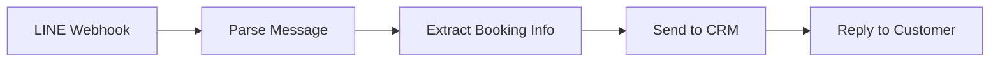
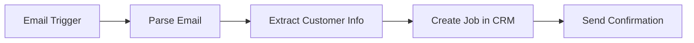
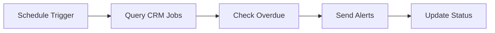

# Webhook API Documentation

The Webhook API handles external integrations with N8N automation platform and LINE Official Account for the Tinedy CRM system.

## Table of Contents

- [Overview](#overview)
- [Endpoints](#endpoints)
- [N8N Integration](#n8n-integration)
- [LINE OA Integration](#line-oa-integration)
- [Security](#security)
- [Examples](#examples)
- [Error Handling](#error-handling)

## Overview

The Webhook API enables:
- **N8N Automation**: Receive workflow execution data and create jobs automatically
- **LINE OA Integration**: Process LINE Official Account messages and events
- **Manual Webhooks**: Support for custom webhook integrations
- **Retry Mechanism**: Automatic retry for failed webhook processing
- **Logging**: Comprehensive webhook activity logging

### Key Features

- **Multi-source Support**: N8N, LINE OA, and custom webhook sources
- **Authentication**: API key and signature-based security
- **Idempotency**: Duplicate detection and handling
- **Async Processing**: Non-blocking webhook processing
- **Rich Logging**: Detailed logs for debugging and monitoring

## Endpoints

### N8N Webhook

```http
POST /api/webhook/n8n
```

Receive workflow execution data from N8N automation platform.

#### Headers

| Header | Required | Description |
|--------|----------|-------------|
| `X-API-Key` | ✅ Yes | N8N webhook API key |
| `Content-Type` | ✅ Yes | `application/json` |
| `X-N8N-Execution-Id` | ❌ No | N8N execution ID (alternative to body) |

#### Request Body

```json
{
  "executionId": "n8n-exec-12345",
  "workflowId": "line-booking-workflow",
  "workflowName": "LINE Booking Automation",
  "status": "success",
  "startedAt": "2024-01-20T09:00:00Z",
  "finishedAt": "2024-01-20T09:02:30Z",
  "data": {
    "customer": {
      "name": "สมชาย ใจดี",
      "lineUserId": "Uab1234567890abcdef1234567890abcdef",
      "phone": "+66812345678",
      "message": "ต้องการจองบริการทำความสะอาด"
    },
    "booking": {
      "serviceType": "บริการทำความสะอาด",
      "preferredDate": "2024-01-25",
      "preferredTime": "09:00",
      "location": "ออฟฟิศ ชั้น 15",
      "notes": "ขอทำเสร็จก่อน 12:00"
    },
    "metadata": {
      "source": "line_oa",
      "messageId": "msg-456789",
      "timestamp": "2024-01-20T08:58:00Z"
    }
  }
}
```

#### Response

```json
{
  "status": "success",
  "message": "Webhook processed successfully",
  "messageTh": "ประมวลผล webhook สำเร็จ",
  "data": {
    "webhookLogId": "clr123webhook456log789",
    "processedAt": "2024-01-20T09:03:00Z",
    "results": {
      "customerCreated": false,
      "customerUpdated": true,
      "jobCreated": true,
      "jobId": "clr789newjob123abc456"
    }
  }
}
```

#### Processing Logic

1. **Validate API Key**: Check N8N webhook API key
2. **Duplicate Detection**: Check for existing execution ID
3. **Customer Processing**:
   - Find existing customer by LINE User ID
   - Create new customer if not found
   - Update customer information if needed
4. **Job Creation**:
   - Create new job based on booking data
   - Set appropriate priority and scheduling
   - Store original webhook data for reference
5. **Logging**: Create webhook log entry

#### Authorization
- **Required**: Valid N8N API key
- **Rate Limit**: 100 requests per minute

---

### LINE OA Webhook

```http
POST /api/webhook/line
```

Process LINE Official Account webhook events.

#### Headers

| Header | Required | Description |
|--------|----------|-------------|
| `X-Line-Signature` | ✅ Yes | LINE webhook signature |
| `Content-Type` | ✅ Yes | `application/json` |

#### Request Body (LINE Webhook Format)

```json
{
  "destination": "Uab1234567890abcdef1234567890abcdef",
  "events": [
    {
      "type": "message",
      "mode": "active",
      "timestamp": 1705745880000,
      "source": {
        "type": "user",
        "userId": "Uab1234567890abcdef1234567890abcdef"
      },
      "message": {
        "id": "456789123456",
        "type": "text",
        "text": "ต้องการจองบริการทำความสะอาดออฟฟิศ"
      },
      "replyToken": "reply-token-123456789"
    }
  ]
}
```

#### Response

```json
{
  "status": "success",
  "message": "LINE webhook processed successfully",
  "messageTh": "ประมวลผล LINE webhook สำเร็จ",
  "data": {
    "webhookLogId": "clr456linewebhook789",
    "processedEvents": 1,
    "results": [
      {
        "eventType": "message",
        "processed": true,
        "action": "booking_inquiry",
        "customerId": "clr123customer456",
        "jobCreated": false,
        "replyMessage": "ได้รับข้อความของคุณแล้ว เจ้าหน้าที่จะติดต่อกลับในไม่ช้า"
      }
    ]
  }
}
```

#### Processing Logic

1. **Signature Validation**: Verify LINE webhook signature
2. **Event Processing**: Process each event in the array
3. **Customer Lookup**: Find customer by LINE User ID
4. **Message Analysis**: Analyze message content for booking intent
5. **Response**: Send appropriate reply message via LINE API
6. **Job Creation**: Create job if booking intent detected

#### Supported Event Types

- **message**: Text messages, images, files
- **follow**: User follows the LINE OA
- **unfollow**: User unfollows the LINE OA
- **join**: Bot joins a group/room
- **leave**: Bot leaves a group/room
- **postback**: Postback data from rich menus/templates

#### Authorization
- **Required**: Valid LINE webhook signature
- **Rate Limit**: 1000 requests per minute

---

### Manual Webhook

```http
POST /api/webhook/manual
```

Process custom webhook integrations.

#### Headers

| Header | Required | Description |
|--------|----------|-------------|
| `X-API-Key` | ✅ Yes | Manual webhook API key |
| `Content-Type` | ✅ Yes | `application/json` |
| `X-Source` | ❌ No | Source system identifier |

#### Request Body

```json
{
  "source": "custom_booking_system",
  "executionId": "custom-exec-789",
  "type": "booking_request",
  "data": {
    "customer": {
      "name": "บริษัท ABC จำกัด",
      "phone": "+66812345678",
      "email": "contact@abc.co.th"
    },
    "service": {
      "type": "บริการฝึกอบรม",
      "description": "ฝึกอบรมความปลอดภัยในการทำงาน",
      "location": "สำนักงานใหญ่",
      "participants": 20,
      "duration": 480
    },
    "scheduling": {
      "preferredDate": "2024-02-01",
      "preferredTime": "09:00",
      "flexible": true
    }
  }
}
```

#### Response

```json
{
  "status": "success",
  "message": "Manual webhook processed successfully",
  "messageTh": "ประมวลผลแบบกำหนดเองสำเร็จ",
  "data": {
    "webhookLogId": "clr789manual123webhook",
    "processedAt": "2024-01-20T10:15:00Z",
    "results": {
      "customerCreated": true,
      "customerId": "clr123newcustomer456",
      "jobCreated": true,
      "jobId": "clr456newjob789"
    }
  }
}
```

#### Authorization
- **Required**: Valid manual webhook API key
- **Rate Limit**: 60 requests per minute

---

### Webhook Status

```http
GET /api/webhook/status/{logId}
```

Get the processing status of a webhook.

#### Path Parameters

| Parameter | Type | Description |
|-----------|------|-------------|
| `logId` | string | Webhook log ID |

#### Response

```json
{
  "id": "clr123webhook456log789",
  "source": "N8N",
  "executionId": "n8n-exec-12345",
  "status": "PROCESSED",
  "processedAt": "2024-01-20T09:03:00Z",
  "retryCount": 0,
  "error": null,
  "results": {
    "customerCreated": false,
    "customerUpdated": true,
    "jobCreated": true,
    "jobId": "clr789newjob123abc456"
  },
  "processingTime": 2500,
  "payload": {
    "executionId": "n8n-exec-12345",
    "workflowId": "line-booking-workflow"
  }
}
```

#### Authorization
- **Required**: Valid API key or authenticated user

---

### Retry Failed Webhook

```http
POST /api/webhook/retry/{logId}
```

Manually retry a failed webhook.

#### Path Parameters

| Parameter | Type | Description |
|-----------|------|-------------|
| `logId` | string | Webhook log ID |

#### Response

```json
{
  "status": "retry_initiated",
  "message": "Webhook retry initiated",
  "messageTh": "เริ่มประมวลผล webhook ใหม่",
  "data": {
    "webhookLogId": "clr123webhook456log789",
    "retryCount": 1,
    "scheduledAt": "2024-01-20T10:30:00Z"
  }
}
```

#### Authorization
- **Required**: Authenticated user with ADMIN role

## N8N Integration

### Workflow Configuration

Configure N8N workflows to send webhook data to Tinedy CRM:

```javascript
// N8N HTTP Request Node Configuration
{
  "url": "https://crm.tinedy.com/api/webhook/n8n",
  "method": "POST",
  "headers": {
    "X-API-Key": "your-n8n-api-key",
    "Content-Type": "application/json"
  },
  "body": {
    "executionId": "{{ $workflow.execution.id }}",
    "workflowId": "{{ $workflow.id }}",
    "workflowName": "{{ $workflow.name }}",
    "status": "{{ $workflow.execution.status }}",
    "data": {
      // Your workflow data
    }
  }
}
```

### Common N8N Workflows

#### 1. LINE Booking Workflow



#### 2. Email to Job Workflow



#### 3. Scheduled Job Status Check



### Best Practices

1. **Error Handling**: Always include error handling in N8N workflows
2. **Idempotency**: Use unique execution IDs to prevent duplicates
3. **Timeouts**: Set appropriate timeouts for webhook calls
4. **Retries**: Configure retry logic for failed webhook calls

## LINE OA Integration

### LINE Bot Setup

1. **Create LINE OA**: Set up LINE Official Account
2. **Get Channel Access Token**: Required for sending messages
3. **Set Webhook URL**: Point to `https://crm.tinedy.com/api/webhook/line`
4. **Configure Rich Menu**: Create booking shortcuts

### Message Processing

#### Intent Recognition

The system analyzes Thai messages for booking intent:

```typescript
const bookingKeywords = [
  'จอง', 'ต้องการ', 'ขอ', 'บริการ',
  'ทำความสะอาด', 'ฝึกอบรม', 'ตรวจสอบ'
];

const urgentKeywords = [
  'ด่วน', 'เร่งด่วน', 'acutally', 'วันนี้'
];
```

#### Auto-responses

Common auto-response patterns:

```typescript
const responses = {
  booking_inquiry: "ได้รับข้อความของคุณแล้ว เจ้าหน้าที่จะติดต่อกลับในไม่ช้า",
  service_question: "สำหรับข้อมูลบริการ กรุณาติดต่อ 02-123-4567",
  urgent_request: "ได้รับคำขอเร่งด่วนแล้ว เจ้าหน้าที่จะติดต่อภายใน 30 นาที",
  general: "สวัสดีครับ มีอะไรให้ช่วยเหลือไหมครับ"
};
```

### Rich Menu Integration

JSON configuration for LINE rich menu:

```json
{
  "size": {
    "width": 2500,
    "height": 1686
  },
  "selected": false,
  "name": "Tinedy Services",
  "chatBarText": "บริการ",
  "areas": [
    {
      "bounds": {
        "x": 0,
        "y": 0,
        "width": 1250,
        "height": 843
      },
      "action": {
        "type": "postback",
        "data": "service=cleaning"
      }
    },
    {
      "bounds": {
        "x": 1250,
        "y": 0,
        "width": 1250,
        "height": 843
      },
      "action": {
        "type": "postback",
        "data": "service=training"
      }
    }
  ]
}
```

## Security

### API Key Authentication

Each webhook source requires a unique API key:

```typescript
// Environment variables
N8N_WEBHOOK_SECRET=your-secure-n8n-key
MANUAL_WEBHOOK_SECRET=your-secure-manual-key

// Header validation
const isValidApiKey = (source: string, apiKey: string) => {
  const secrets = {
    n8n: process.env.N8N_WEBHOOK_SECRET,
    manual: process.env.MANUAL_WEBHOOK_SECRET
  };
  return apiKey === secrets[source];
};
```

### LINE Signature Verification

```typescript
import crypto from 'crypto';

const verifyLineSignature = (signature: string, body: string, secret: string) => {
  const hash = crypto
    .createHmac('sha256', secret)
    .update(body)
    .digest('base64');

  return signature === hash;
};
```

### Rate Limiting

Rate limits by source:

| Source | Limit | Window |
|--------|-------|--------|
| N8N | 100 requests | 1 minute |
| LINE OA | 1000 requests | 1 minute |
| Manual | 60 requests | 1 minute |

### IP Whitelisting

Optional IP whitelisting for enhanced security:

```typescript
const allowedIPs = {
  n8n: ['203.0.113.1', '203.0.113.2'],
  line: ['147.92.150.0/24', '147.92.151.0/24']
};
```

## Examples

### N8N Job Creation

```http
POST /api/webhook/n8n
X-API-Key: your-n8n-api-key
Content-Type: application/json

{
  "executionId": "n8n-exec-67890",
  "workflowId": "email-to-job-workflow",
  "workflowName": "Email Booking to Job",
  "status": "success",
  "data": {
    "email": {
      "from": "customer@company.co.th",
      "subject": "จองบริการฝึกอบรม",
      "body": "ต้องการจองบริการฝึกอบรมความปลอดภัย วันที่ 15 ก.พ. 2024"
    },
    "extracted": {
      "serviceType": "บริการฝึกอบรม",
      "preferredDate": "2024-02-15",
      "customerEmail": "customer@company.co.th"
    }
  }
}

Response:
{
  "status": "success",
  "data": {
    "webhookLogId": "clr456webhook789log",
    "results": {
      "customerCreated": true,
      "customerId": "clr789customer123",
      "jobCreated": true,
      "jobId": "clr123job456"
    }
  }
}
```

### LINE OA Message Processing

```http
POST /api/webhook/line
X-Line-Signature: base64-encoded-signature
Content-Type: application/json

{
  "destination": "Uab1234567890abcdef1234567890abcdef",
  "events": [
    {
      "type": "message",
      "timestamp": 1705745880000,
      "source": {
        "type": "user",
        "userId": "Uab1234567890abcdef1234567890abcdef"
      },
      "message": {
        "id": "456789123456",
        "type": "text",
        "text": "ต้องการจองบริการทำความสะอาดออฟฟิศด่วน"
      },
      "replyToken": "reply-token-123456789"
    }
  ]
}

Response:
{
  "status": "success",
  "data": {
    "processedEvents": 1,
    "results": [
      {
        "eventType": "message",
        "processed": true,
        "action": "urgent_booking_inquiry",
        "customerId": "clr456customer789",
        "jobCreated": true,
        "jobId": "clr789urgentjob123",
        "replyMessage": "ได้รับคำขอเร่งด่วนแล้ว เจ้าหน้าที่จะติดต่อภายใน 30 นาที"
      }
    ]
  }
}
```

### Manual System Integration

```http
POST /api/webhook/manual
X-API-Key: your-manual-webhook-key
X-Source: erp_system
Content-Type: application/json

{
  "source": "erp_system",
  "executionId": "erp-booking-2024-001",
  "type": "bulk_booking",
  "data": {
    "bookings": [
      {
        "customer": {
          "name": "บริษัท XYZ จำกัด",
          "phone": "+66823456789",
          "email": "admin@xyz.co.th"
        },
        "service": {
          "type": "บริการตรวจสอบคุณภาพ",
          "location": "โรงงาน 1",
          "priority": "HIGH"
        },
        "schedule": {
          "date": "2024-02-10",
          "time": "08:00"
        }
      }
    ]
  }
}

Response:
{
  "status": "success",
  "data": {
    "webhookLogId": "clr123bulkwebhook456",
    "results": {
      "totalBookings": 1,
      "customersCreated": 1,
      "jobsCreated": 1,
      "failed": 0,
      "details": [
        {
          "customerId": "clr789newcustomer123",
          "jobId": "clr456newjob789",
          "status": "created"
        }
      ]
    }
  }
}
```

## Error Handling

### Common Error Responses

#### 401 Unauthorized - Invalid API Key

```json
{
  "error": "Invalid API key",
  "errorTh": "API key ไม่ถูกต้อง",
  "code": "INVALID_API_KEY",
  "timestamp": "2024-01-20T10:30:00Z",
  "details": {
    "source": "n8n",
    "providedKey": "invalid-key-123"
  }
}
```

#### 400 Bad Request - Invalid LINE Signature

```json
{
  "error": "Invalid LINE webhook signature",
  "errorTh": "ลายเซ็น LINE webhook ไม่ถูกต้อง",
  "code": "INVALID_LINE_SIGNATURE",
  "timestamp": "2024-01-20T10:30:00Z",
  "details": {
    "expectedSignature": "base64-hash",
    "providedSignature": "invalid-signature"
  }
}
```

#### 409 Conflict - Duplicate Execution

```json
{
  "error": "Webhook execution already processed",
  "errorTh": "ประมวลผล webhook นี้แล้ว",
  "code": "DUPLICATE_EXECUTION",
  "timestamp": "2024-01-20T10:30:00Z",
  "details": {
    "executionId": "n8n-exec-12345",
    "originalProcessedAt": "2024-01-20T09:03:00Z",
    "originalWebhookLogId": "clr123webhook456log789"
  }
}
```

#### 500 Internal Server Error - Processing Failed

```json
{
  "error": "Webhook processing failed",
  "errorTh": "การประมวลผล webhook ล้มเหลว",
  "code": "PROCESSING_FAILED",
  "timestamp": "2024-01-20T10:30:00Z",
  "details": {
    "webhookLogId": "clr456failed789log",
    "retryCount": 2,
    "nextRetryAt": "2024-01-20T10:35:00Z",
    "error": "Database connection timeout"
  }
}
```

### Error Codes Reference

| Code | HTTP Status | Description |
|------|-------------|-------------|
| `INVALID_API_KEY` | 401 | API key authentication failed |
| `INVALID_LINE_SIGNATURE` | 400 | LINE webhook signature invalid |
| `INVALID_PAYLOAD` | 400 | Webhook payload validation failed |
| `DUPLICATE_EXECUTION` | 409 | Execution ID already processed |
| `RATE_LIMIT_EXCEEDED` | 429 | Too many requests |
| `PROCESSING_FAILED` | 500 | Internal processing error |
| `CUSTOMER_CREATE_FAILED` | 422 | Customer creation failed |
| `JOB_CREATE_FAILED` | 422 | Job creation failed |
| `LINE_API_ERROR` | 502 | LINE API communication failed |