# N8N API Integration Contract - Epic 2.1: Admin Job Booking Management

## เอกสารสัญญา API สำหรับการเชื่อมต่อ N8N กับระบบ Tinedy CRM

**เวอร์ชัน:** 1.0
**วันที่:** 28 กันยายน 2567
**ผู้จัดทำ:** Morgan 📈 (Business Analyst)
**สถานะ:** Ready for Implementation

---

## สารบัญ

1. [ภาพรวมของสัญญา API](#1-ภาพรวมของสัญญา-api)
2. [ข้อกำหนดทางธุรกิจ](#2-ข้อกำหนดทางธุรกิจ)
3. [ข้อมูลจำเพาะทางเทคนิค](#3-ข้อมูลจำเพาะทางเทคนิค)
4. [การรับรองความถูกต้องและการรักษาความปลอดภัย](#4-การรับรองความถูกต้องและการรักษาความปลอดภัย)
5. [การจัดการข้อผิดพลาดและกลไกการลองใหม่](#5-การจัดการข้อผิดพลาดและกลไกการลองใหม่)
6. [ขั้นตอนการทดสอบและเกณฑ์การยอมรับ](#6-ขั้นตอนการทดสอบและเกณฑ์การยอมรับ)
7. [ข้อกำหนด SLA และประสิทธิภาพ](#7-ข้อกำหนด-sla-และประสิทธิภาพ)
8. [ข้อตกลงการสนับสนุนและการบำรุงรักษา](#8-ข้อตกลงการสนับสนุนและการบำรุงรักษา)
9. [กระบวนการจัดการการเปลี่ยนแปลง](#9-กระบวนการจัดการการเปลี่ยนแปลง)
10. [ตัวชี้วัดความสำเร็จและ KPIs](#10-ตัวชี้วัดความสำเร็จและ-kpis)

---

## 1. ภาพรวมของสัญญา API

### 1.1 วัตถุประสงค์
เอกสารนี้กำหนดรายละเอียดการเชื่อมต่อระหว่าง N8N automation platform และระบบ Tinedy CRM สำหรับ Epic 2.1: Admin Job Booking Management โดยครอบคลุมการสร้างงาน (Job) อัตโนมัติจากข้อมูลการจองที่ได้รับผ่าน LINE Official Account

### 1.2 ขอบเขตของการเชื่อมต่อ
- **การรับข้อมูลงาน:** N8N ส่งข้อมูลการจองผ่าน webhook endpoint
- **การจัดการลูกค้า:** ค้นหา/สร้างข้อมูลลูกค้าอัตโนมัติ
- **การสร้างงาน:** สร้างงานใหม่ตามประเภทบริการ (CLEANING, TRAINING)
- **การมอบหมายงาน:** กำหนดงานให้ทีมปฏิบัติการ
- **การติดตามสถานะ:** ระบบ logging และ monitoring แบบ real-time

### 1.3 ผู้มีส่วนเกี่ยวข้องหลัก
- **ทีม N8N:** ผู้ส่งข้อมูลผ่าน webhook
- **ทีม Tinedy CRM:** ผู้รับและประมวลผลข้อมูล
- **ทีม Admin:** ผู้ใช้งานระบบ CRM
- **ทีม Operations:** ผู้รับมอบหมายงาน

---

## 2. ข้อกำหนดทางธุรกิจ

### 2.1 กระบวนการทางธุรกิจหลัก

#### 2.1.1 Customer Onboarding Process

```mermaid
graph TD
    A[ลูกค้าส่งข้อความใน LINE OA] --> B[N8N ประมวลผลข้อความ]
    B --> C[N8N ส่งข้อมูลไปยัง CRM]
    C --> D{ตรวจสอบลูกค้าในระบบ}
    D -->|ไม่พบ| E[สร้างลูกค้าใหม่]
    D -->|พบแล้ว| F[อัปเดตข้อมูลลูกค้า]
    E --> G[สร้างงานใหม่]
    F --> G
    G --> H[มอบหมายงานให้ทีม]
    H --> I[แจ้งเตือนทีม Admin]
```


#### 2.1.2 Job Assignment Automation

```mermaid
graph TD
    A[สร้างงานสำเร็จ] --> B{ประเภทบริการ}
    B -->|CLEANING| C[กำหนดให้ Operations Team]
    B -->|TRAINING| D[กำหนดให้ Training Team]
    C --> E[ส่งแจ้งเตือนไปยัง LINE]
    D --> E
    E --> F[บันทึก Audit Log]
```


### 2.2 Business Rules และข้อจำกัด

#### 2.2.1 Customer Management Rules
- **Customer Matching Logic:** ใช้ LINE User ID เป็น primary key สำหรับการจับคู่
- **Phone Number Validation:** หมายเลขโทรศัพท์ต้องเป็นรูปแบบไทย (+66xxxxxxxxx)
- **Duplicate Prevention:** ตรวจสอบการซ้ำซ้อนด้วย Phone Number และ LINE User ID
- **Data Quality:** ชื่อลูกค้าต้องมีความยาวระหว่าง 2-100 ตัวอักษร

#### 2.2.2 Job Creation Rules
- **Service Type Validation:** รองรับเฉพาะ CLEANING และ TRAINING
- **Priority Assignment:**
  - คำขอด่วน → HIGH priority
  - คำขอทั่วไป → MEDIUM priority
  - คำขอปกติ → LOW priority
- **Auto-scheduling:** หากไม่ระบุวันที่ ให้กำหนดเป็น +7 วันจากวันที่ปัจจุบัน
- **Job Assignment Logic:**
  - CLEANING → มอบหมายให้ Operations Team
  - TRAINING → มอบหมายให้ Training Team

#### 2.2.3 Data Integrity Constraints
- **Required Fields:** Customer name, service type, contact channel
- **Data Retention:** เก็บ webhook logs ไว้ 90 วัน
- **Audit Trail:** บันทึกการเปลี่ยนแปลงทุกขั้นตอน

---

## 3. ข้อมูลจำเพาะทางเทคนิค

### 3.1 Webhook Endpoint Specifications

#### 3.1.1 Primary Endpoint
```
POST https://crm.tinedy.com/api/webhook/n8n
```

#### 3.1.2 Request Headers
```http
Content-Type: application/json
X-API-Key: {N8N_WEBHOOK_SECRET}
X-N8N-Execution-Id: {execution_id}
X-N8N-Workflow-Id: {workflow_id}
User-Agent: N8N-Webhook/1.0
```

#### 3.1.3 Request Payload Schema

```typescript
interface N8NJobBookingPayload {
  // ข้อมูล N8N Workflow
  workflow: {
    id: string;                    // รหัส N8N workflow
    name: string;                  // ชื่อ workflow
    executionId: string;           // รหัสการรัน (unique)
    timestamp: string;             // เวลาการรัน ISO 8601
    version?: string;              // เวอร์ชัน workflow
  };

  // ข้อมูลลูกค้าจาก LINE OA
  customer: {
    lineUserId: string;            // รหัสผู้ใช้ LINE (required)
    displayName: string;           // ชื่อที่แสดงใน LINE (required)
    phone?: string;                // เบอร์โทรศัพท์ รูปแบบ +66xxxxxxxxx
    email?: string;                // อีเมล (optional)
    pictureUrl?: string;           // รูปโปรไฟล์ LINE
    language?: 'th' | 'en';        // ภาษาที่ใช้
    statusMessage?: string;        // สถานะข้อความ LINE
  };

  // ข้อมูลการจองบริการ
  booking: {
    serviceType: 'CLEANING' | 'TRAINING'; // ประเภทบริการ (required)
    description: string;           // รายละเอียดงาน (required)
    preferredDate?: string;        // วันที่ต้องการ ISO 8601 date
    preferredTime?: string;        // เวลาที่ต้องการ HH:MM format
    priority: 'LOW' | 'MEDIUM' | 'HIGH' | 'URGENT'; // ความสำคัญ
    location?: string;             // สถานที่ปฏิบัติงาน
    specialRequirements?: string;  // ความต้องการพิเศษ
    estimatedDuration?: number;    // ระยะเวลาโดยประมาณ (นาที)
    budget?: number;               // งบประมาณ (บาท)
    urgentKeywords?: string[];     // คำสำคัญที่บ่งบอกความเร่งด่วน
  };

  // ข้อมูลบริบทการสนทนา
  conversation: {
    messageId: string;             // รหัสข้อความ LINE
    messageType: 'text' | 'image' | 'audio' | 'video' | 'file' | 'location' | 'sticker';
    messageText?: string;          // ข้อความต้นฉบับ
    replyToken?: string;           // token สำหรับตอบกลับ
    timestamp: string;             // เวลาที่ส่งข้อความ ISO 8601
    chatType: 'user' | 'group' | 'room'; // ประเภทการสนทนา
  };

  // ข้อมูลเพิ่มเติม
  metadata: {
    source: 'LINE_OA';            // แหล่งที่มาข้อมูล
    channelId: string;            // รหัสช่องทาง LINE
    webhookEventType: string;     // ประเภท event
    processing: {
      startedAt: string;          // เวลาเริ่มประมวลผลใน N8N
      completedAt: string;        // เวลาเสร็จสิ้นใน N8N
      steps: string[];            // ขั้นตอนการประมวลผล
    };
    userAgent?: string;           // User agent
    ipAddress?: string;           // IP address ของลูกค้า
    rawPayload?: any;             // ข้อมูลดิบทั้งหมด (สำหรับ debug)
  };
}
```

#### 3.1.4 Response Schema

##### Success Response (HTTP 200)
```typescript
interface WebhookSuccessResponse {
  status: 'success';
  message: string;
  messageTh: string;              // ข้อความภาษาไทย
  timestamp: string;              // ISO 8601
  processingTime: number;         // เวลาประมวลผล (milliseconds)
  data: {
    webhookLogId: string;         // รหัส webhook log
    executionId: string;          // รหัสการรัน N8N
    processedAt: string;          // เวลาที่ประมวลผลเสร็จ
    results: {
      customer: {
        id: string;               // รหัสลูกค้า
        action: 'created' | 'updated' | 'found'; // การดำเนินการ
        isNewCustomer: boolean;   // ลูกค้าใหม่หรือไม่
      };
      job: {
        id: string;               // รหัสงาน
        status: 'NEW' | 'ASSIGNED'; // สถานะงาน
        priority: string;         // ความสำคัญ
        assignedToTeam?: string;  // ทีมที่ได้รับมอบหมาย
        scheduledAt?: string;     // วันที่กำหนดการ
      };
      notifications: {
        sentToAdmin: boolean;     // แจ้งเตือน Admin
        sentToTeam: boolean;      // แจ้งเตือนทีม
        lineReplyMessage?: string; // ข้อความตอบกลับใน LINE
      };
    };
    warnings?: string[];          // คำเตือน (ถ้ามี)
  };
}
```

##### Error Response (HTTP 4xx/5xx)
```typescript
interface WebhookErrorResponse {
  status: 'error';
  error: {
    code: string;                 // รหัสข้อผิดพลาด
    message: string;              // ข้อความข้อผิดพลาด (EN)
    messageTh: string;            // ข้อความข้อผิดพลาด (TH)
    details?: any;                // รายละเอียดเพิ่มเติม
  };
  timestamp: string;
  webhookLogId?: string;          // รหัส webhook log (ถ้าสร้างได้)
  retryInfo?: {
    canRetry: boolean;            // สามารถลองใหม่ได้หรือไม่
    nextRetryAt?: string;         // เวลาที่จะลองใหม่
    retryCount: number;           // จำนวนครั้งที่ลองแล้ว
    maxRetries: number;           // จำนวนครั้งสูงสุด
  };
}
```

### 3.2 API Testing Endpoints

#### 3.2.1 Health Check
```
GET https://crm.tinedy.com/api/webhook/health
```

Response:
```json
{
  "status": "healthy",
  "timestamp": "2024-09-28T10:30:00Z",
  "version": "1.0.0",
  "services": {
    "database": "connected",
    "webhook_processor": "ready",
    "n8n_integration": "active"
  }
}
```

#### 3.2.2 Test Endpoint
```
POST https://crm.tinedy.com/api/webhook/n8n/test
```

Headers:
```
X-API-Key: test_key_for_integration_testing
```

### 3.3 Data Validation Rules

#### 3.3.1 Required Field Validation
```typescript
const requiredFields = {
  'workflow.id': 'string',
  'workflow.executionId': 'string',
  'customer.lineUserId': 'string',
  'customer.displayName': 'string',
  'booking.serviceType': ['CLEANING', 'TRAINING'],
  'booking.description': 'string',
  'booking.priority': ['LOW', 'MEDIUM', 'HIGH', 'URGENT'],
  'conversation.messageId': 'string',
  'metadata.source': 'LINE_OA'
};
```

#### 3.3.2 Data Format Validation
```typescript
const validationRules = {
  phone: /^\+66[0-9]{9}$/,                    // เบอร์โทรไทย
  email: /^[^\s@]+@[^\s@]+\.[^\s@]+$/,        // รูปแบบอีเมล
  lineUserId: /^U[a-f0-9]{32}$/,              // LINE User ID
  timestamp: /^\d{4}-\d{2}-\d{2}T\d{2}:\d{2}:\d{2}(\.\d{3})?Z$/, // ISO 8601
  executionId: /^[a-zA-Z0-9_-]+$/,            // N8N execution ID
  cuid: /^c[a-z0-9]{24}$/                     // CUID format
};
```

---

## 4. การรับรองความถูกต้องและการรักษาความปลอดภัย

### 4.1 API Key Authentication

#### 4.1.1 API Key Management
```typescript
interface ApiKeyConfig {
  keyId: string;                  // รหัสประจำ API key
  secretKey: string;              // API key secret (256-bit)
  algorithm: 'HS256';             // Algorithm สำหรับ signature
  expiresAt?: string;             // วันหมดอายุ (optional)
  permissions: string[];          // สิทธิ์การใช้งาน
  rateLimits: {
    requestsPerMinute: number;    // จำนวนคำขอต่อนาที
    requestsPerHour: number;      // จำนวนคำขอต่อชั่วโมง
    dailyQuota: number;           // โควต้ารายวัน
  };
}
```

#### 4.1.2 Request Signature Verification
```typescript
// การสร้าง signature ฝั่ง N8N
const createSignature = (payload: string, secret: string, timestamp: string): string => {
  const message = `${timestamp}.${payload}`;
  return crypto.createHmac('sha256', secret).update(message).digest('hex');
};

// Header สำหรับการยืนยันตัวตน
interface AuthHeaders {
  'X-API-Key': string;            // API key
  'X-Timestamp': string;          // Unix timestamp
  'X-Signature': string;          // HMAC-SHA256 signature
  'X-N8N-Execution-Id': string;   // Unique execution ID
}
```

### 4.2 Security Measures

#### 4.2.1 Input Validation และ Sanitization
```typescript
const securityRules = {
  // XSS Prevention
  sanitizeHtml: true,
  stripScripts: true,
  maxStringLength: 10000,

  // SQL Injection Prevention (โดย Prisma ORM)
  useParameterizedQueries: true,
  escapeUserInput: true,

  // Rate Limiting
  maxRequestsPerMinute: 100,
  maxRequestsPerHour: 5000,

  // IP Whitelisting (optional)
  allowedIPs: [
    '203.0.113.0/24',     // N8N server range
    '198.51.100.0/24'     // Backup server range
  ]
};
```

#### 4.2.2 Error Response Security
```typescript
// ไม่เปิดเผยข้อมูลระบบภายใน
const sanitizeError = (error: Error, env: string) => {
  if (env === 'production') {
    return {
      code: 'INTERNAL_ERROR',
      message: 'An internal error occurred',
      messageTh: 'เกิดข้อผิดพลาดภายในระบบ'
    };
  }
  return {
    code: error.name,
    message: error.message,
    messageTh: translateError(error.message)
  };
};
```

### 4.3 Data Privacy และ PDPA Compliance

#### 4.3.1 Personal Data Handling
```typescript
const pdpaCompliance = {
  dataCategories: {
    personal: ['name', 'phone', 'email'],           // ข้อมูลส่วนบุคคล
    sensitive: ['lineUserId', 'pictureUrl'],        // ข้อมูลละเอียดอ่อน
    operational: ['serviceType', 'description']     // ข้อมูลการดำเนินงาน
  },

  retentionPeriod: {
    webhookLogs: 90,        // วัน
    customerData: 2555,     // วัน (7 ปี)
    jobData: 1825          // วัน (5 ปี)
  },

  encryption: {
    atRest: true,           // เข้ารหัสข้อมูลในฐานข้อมูล
    inTransit: true,        // เข้ารหัสข้อมูลระหว่างส่ง
    algorithm: 'AES-256-GCM'
  }
};
```

---

## 5. การจัดการข้อผิดพลาดและกลไกการลองใหม่

### 5.1 Error Classification

#### 5.1.1 Error Categories
```typescript
enum ErrorCategory {
  // Client Errors (4xx) - ข้อผิดพลาดจากฝั่งผู้ส่ง
  CLIENT_ERROR = 'CLIENT_ERROR',

  // Server Errors (5xx) - ข้อผิดพลาดจากฝั่งเซิร์ฟเวอร์
  SERVER_ERROR = 'SERVER_ERROR',

  // Business Logic Errors - ข้อผิดพลาดทางธุรกิจ
  BUSINESS_ERROR = 'BUSINESS_ERROR',

  // External Service Errors - ข้อผิดพลาดจากบริการภายนอก
  EXTERNAL_ERROR = 'EXTERNAL_ERROR'
}

interface ErrorDefinition {
  code: string;
  httpStatus: number;
  category: ErrorCategory;
  retryable: boolean;
  description: string;
  descriptionTh: string;
  resolution: string;
}
```

#### 5.1.2 Comprehensive Error Codes
```typescript
const errorCodes: Record<string, ErrorDefinition> = {
  // Authentication Errors
  INVALID_API_KEY: {
    code: 'INVALID_API_KEY',
    httpStatus: 401,
    category: ErrorCategory.CLIENT_ERROR,
    retryable: false,
    description: 'Invalid or missing API key',
    descriptionTh: 'API key ไม่ถูกต้องหรือไม่พบ',
    resolution: 'ตรวจสอบ API key และส่งในหัว X-API-Key'
  },

  EXPIRED_API_KEY: {
    code: 'EXPIRED_API_KEY',
    httpStatus: 401,
    category: ErrorCategory.CLIENT_ERROR,
    retryable: false,
    description: 'API key has expired',
    descriptionTh: 'API key หมดอายุแล้ว',
    resolution: 'ขอ API key ใหม่จากทีม Tinedy CRM'
  },

  // Validation Errors
  INVALID_PAYLOAD: {
    code: 'INVALID_PAYLOAD',
    httpStatus: 400,
    category: ErrorCategory.CLIENT_ERROR,
    retryable: false,
    description: 'Request payload validation failed',
    descriptionTh: 'ข้อมูลที่ส่งมาไม่ถูกต้อง',
    resolution: 'ตรวจสอบรูปแบบข้อมูลตาม API specification'
  },

  MISSING_REQUIRED_FIELDS: {
    code: 'MISSING_REQUIRED_FIELDS',
    httpStatus: 400,
    category: ErrorCategory.CLIENT_ERROR,
    retryable: false,
    description: 'Required fields are missing',
    descriptionTh: 'ข้อมูลที่จำเป็นยังไม่ครบถ้วน',
    resolution: 'เพิ่มฟิลด์ที่จำเป็นตามที่ระบุใน error details'
  },

  // Business Logic Errors
  INVALID_SERVICE_TYPE: {
    code: 'INVALID_SERVICE_TYPE',
    httpStatus: 422,
    category: ErrorCategory.BUSINESS_ERROR,
    retryable: false,
    description: 'Service type not supported',
    descriptionTh: 'ประเภทบริการไม่รองรับ',
    resolution: 'ใช้ CLEANING หรือ TRAINING เท่านั้น'
  },

  DUPLICATE_EXECUTION: {
    code: 'DUPLICATE_EXECUTION',
    httpStatus: 409,
    category: ErrorCategory.BUSINESS_ERROR,
    retryable: false,
    description: 'Execution ID already processed',
    descriptionTh: 'ประมวลผล execution ID นี้แล้ว',
    resolution: 'ตรวจสอบ execution ID หรือใช้ ID ใหม่'
  },

  // Database Errors
  DATABASE_CONNECTION_ERROR: {
    code: 'DATABASE_CONNECTION_ERROR',
    httpStatus: 503,
    category: ErrorCategory.SERVER_ERROR,
    retryable: true,
    description: 'Database connection failed',
    descriptionTh: 'ไม่สามารถเชื่อมต่อฐานข้อมูลได้',
    resolution: 'ลองใหม่ใน 30 วินาที'
  },

  CUSTOMER_CREATION_FAILED: {
    code: 'CUSTOMER_CREATION_FAILED',
    httpStatus: 422,
    category: ErrorCategory.BUSINESS_ERROR,
    retryable: true,
    description: 'Failed to create customer record',
    descriptionTh: 'ไม่สามารถสร้างข้อมูลลูกค้าได้',
    resolution: 'ตรวจสอบข้อมูลลูกค้าและลองใหม่'
  },

  JOB_CREATION_FAILED: {
    code: 'JOB_CREATION_FAILED',
    httpStatus: 422,
    category: ErrorCategory.BUSINESS_ERROR,
    retryable: true,
    description: 'Failed to create job record',
    descriptionTh: 'ไม่สามารถสร้างงานได้',
    resolution: 'ตรวจสอบข้อมูลงานและลองใหม่'
  },

  // Rate Limiting
  RATE_LIMIT_EXCEEDED: {
    code: 'RATE_LIMIT_EXCEEDED',
    httpStatus: 429,
    category: ErrorCategory.CLIENT_ERROR,
    retryable: true,
    description: 'Rate limit exceeded',
    descriptionTh: 'ส่งคำขอเกินจำนวนที่กำหนด',
    resolution: 'รอ 60 วินาทีแล้วลองใหม่'
  },

  // External Service Errors
  LINE_API_ERROR: {
    code: 'LINE_API_ERROR',
    httpStatus: 502,
    category: ErrorCategory.EXTERNAL_ERROR,
    retryable: true,
    description: 'LINE API communication failed',
    descriptionTh: 'ไม่สามารถติดต่อ LINE API ได้',
    resolution: 'ลองใหม่ใน 60 วินาที'
  }
};
```

### 5.2 Retry Strategy

#### 5.2.1 Retry Configuration
```typescript
interface RetryConfiguration {
  maxRetries: number;
  retryableErrors: string[];
  backoffStrategy: 'fixed' | 'exponential' | 'linear';
  initialDelay: number;        // milliseconds
  maxDelay: number;            // milliseconds
  jitter: boolean;             // เพิ่มความสุ่มเพื่อป้องกัน thundering herd
}

const retryConfig: RetryConfiguration = {
  maxRetries: 3,
  retryableErrors: [
    'DATABASE_CONNECTION_ERROR',
    'CUSTOMER_CREATION_FAILED',
    'JOB_CREATION_FAILED',
    'RATE_LIMIT_EXCEEDED',
    'LINE_API_ERROR'
  ],
  backoffStrategy: 'exponential',
  initialDelay: 1000,          // 1 วินาที
  maxDelay: 30000,             // 30 วินาที
  jitter: true
};
```

#### 5.2.2 Retry Logic Implementation
```typescript
const calculateRetryDelay = (attempt: number, config: RetryConfiguration): number => {
  let delay: number;

  switch (config.backoffStrategy) {
    case 'exponential':
      delay = config.initialDelay * Math.pow(2, attempt);
      break;
    case 'linear':
      delay = config.initialDelay * (attempt + 1);
      break;
    case 'fixed':
    default:
      delay = config.initialDelay;
  }

  // จำกัดไม่ให้เกิน maxDelay
  delay = Math.min(delay, config.maxDelay);

  // เพิ่ม jitter เพื่อกระจายการเรียก
  if (config.jitter) {
    delay += Math.random() * 1000;
  }

  return delay;
};
```

### 5.3 Error Monitoring และ Alerting

#### 5.3.1 Error Tracking Metrics
```typescript
interface ErrorMetrics {
  timestamp: string;
  errorCode: string;
  errorCategory: ErrorCategory;
  httpStatus: number;
  executionId?: string;
  retryCount: number;
  processingTime: number;
  userAgent?: string;
  ipAddress?: string;
  stackTrace?: string;        // เฉพาะ development environment
}
```

#### 5.3.2 Alert Conditions
```typescript
const alertRules = {
  // Critical Alerts (ส่งทันที)
  critical: {
    errorRate: {
      threshold: 10,            // 10% error rate
      window: '5m',             // ใน 5 นาที
      action: 'immediate_alert'
    },
    consecutiveFailures: {
      threshold: 5,             // 5 ครั้งติดต่อกัน
      action: 'immediate_alert'
    }
  },

  // Warning Alerts (รวมส่งทุก 15 นาที)
  warning: {
    errorRate: {
      threshold: 5,             // 5% error rate
      window: '15m',            // ใน 15 นาที
      action: 'batch_alert'
    },
    retryExhaustion: {
      threshold: 3,             // 3 ครั้งที่ลองครบแล้ว
      window: '10m',
      action: 'batch_alert'
    }
  }
};
```

---

## 6. ขั้นตอนการทดสอบและเกณฑ์การยอมรับ

### 6.1 Testing Strategy

#### 6.1.1 Testing Pyramid


#### 6.1.2 Test Categories

##### Unit Tests (60%)
- **Webhook Payload Validation**
- **Customer Data Transformation**
- **Job Creation Logic**
- **Error Handling Functions**
- **Retry Mechanism**

##### Integration Tests (30%)
- **Database Operations**
- **External API Calls**
- **Authentication Flow**
- **End-to-end Webhook Processing**

##### E2E Tests (10%)
- **Complete Business Scenarios**
- **Performance Under Load**
- **Disaster Recovery**

### 6.2 Test Environment Setup

#### 6.2.1 Testing Infrastructure
```yaml
environments:
  development:
    url: "https://crm-dev.tinedy.com"
    database: "tinedy_crm_dev"
    webhook_endpoint: "/api/webhook/n8n"
    api_key: "dev_test_key_123"

  staging:
    url: "https://crm-staging.tinedy.com"
    database: "tinedy_crm_staging"
    webhook_endpoint: "/api/webhook/n8n"
    api_key: "staging_test_key_456"

  production:
    url: "https://crm.tinedy.com"
    database: "tinedy_crm_production"
    webhook_endpoint: "/api/webhook/n8n"
    api_key: "prod_api_key_xxx"
```

#### 6.2.2 Test Data Sets
```typescript
const testDataSets = {
  // ข้อมูลทดสอบพื้นฐาน
  basicScenarios: [
    {
      name: "New customer CLEANING booking",
      payload: {
        customer: { lineUserId: "U123test", displayName: "ทดสอบ ใหม่" },
        booking: { serviceType: "CLEANING", description: "ทำความสะอาดออฟฟิศ" }
      },
      expected: { customerCreated: true, jobCreated: true }
    },
    {
      name: "Existing customer TRAINING booking",
      payload: {
        customer: { lineUserId: "U456existing", displayName: "ลูกค้าเก่า" },
        booking: { serviceType: "TRAINING", description: "ฝึกอบรมความปลอดภัย" }
      },
      expected: { customerCreated: false, jobCreated: true }
    }
  ],

  // ข้อมูลทดสอบ edge cases
  edgeCases: [
    {
      name: "Invalid service type",
      payload: { booking: { serviceType: "INVALID_TYPE" } },
      expectedError: "INVALID_SERVICE_TYPE"
    },
    {
      name: "Duplicate execution ID",
      payload: { workflow: { executionId: "duplicate_exec_123" } },
      expectedError: "DUPLICATE_EXECUTION"
    }
  ],

  // ข้อมูลทดสอบประสิทธิภาพ
  performanceTests: [
    {
      name: "High volume concurrent requests",
      concurrency: 50,
      requestCount: 1000,
      expectedResponseTime: 2000 // ms
    }
  ]
};
```

### 6.3 Acceptance Criteria

#### 6.3.1 Functional Requirements
```typescript
const acceptanceCriteria = {
  // AC-1: Webhook Processing
  webhookProcessing: {
    requirement: "ระบบต้องรับและประมวลผล webhook จาก N8N ได้สำเร็จ",
    testCases: [
      {
        id: "AC1-TC1",
        description: "ประมวลผล webhook payload ที่ถูกต้อง",
        steps: [
          "ส่ง valid webhook payload ไปยัง endpoint",
          "ตรวจสอบ response status 200",
          "ตรวจสอบ webhook log ถูกสร้าง",
          "ตรวจสอบ customer และ job ถูกสร้าง"
        ],
        expected: "ระบบประมวลผลสำเร็จและส่ง response ที่ถูกต้อง"
      }
    ]
  },

  // AC-2: Customer Management
  customerManagement: {
    requirement: "ระบบต้องค้นหาและสร้างลูกค้าได้ถูกต้อง",
    testCases: [
      {
        id: "AC2-TC1",
        description: "สร้างลูกค้าใหม่เมื่อไม่พบ LINE User ID",
        steps: [
          "ส่ง webhook ด้วย LINE User ID ใหม่",
          "ตรวจสอบการสร้างลูกค้าใหม่",
          "ตรวจสอบข้อมูลลูกค้าถูกต้อง"
        ],
        expected: "สร้างลูกค้าใหม่สำเร็จพร้อมข้อมูลที่ถูกต้อง"
      },
      {
        id: "AC2-TC2",
        description: "อัปเดตข้อมูลลูกค้าเมื่อพบ LINE User ID ซ้ำ",
        steps: [
          "ส่ง webhook ด้วย LINE User ID ที่มีอยู่แล้ว",
          "ตรวจสอบการอัปเดตข้อมูลลูกค้า",
          "ตรวจสอบไม่มีการสร้างลูกค้าซ้ำ"
        ],
        expected: "อัปเดตข้อมูลลูกค้าสำเร็จไม่สร้างรายการซ้ำ"
      }
    ]
  },

  // AC-3: Job Creation
  jobCreation: {
    requirement: "ระบบต้องสร้างงานตามประเภทบริการได้ถูกต้อง",
    testCases: [
      {
        id: "AC3-TC1",
        description: "สร้างงาน CLEANING และมอบหมายให้ Operations Team",
        steps: [
          "ส่ง webhook ด้วย serviceType = CLEANING",
          "ตรวจสอบการสร้างงาน",
          "ตรวจสอบการมอบหมายให้ Operations Team"
        ],
        expected: "สร้างงาน CLEANING และมอบหมายให้ทีมที่ถูกต้อง"
      },
      {
        id: "AC3-TC2",
        description: "สร้างงาน TRAINING และมอบหมายให้ Training Team",
        steps: [
          "ส่ง webhook ด้วย serviceType = TRAINING",
          "ตรวจสอบการสร้างงาน",
          "ตรวจสอบการมอบหมายให้ Training Team"
        ],
        expected: "สร้างงาน TRAINING และมอบหมายให้ทีมที่ถูกต้อง"
      }
    ]
  }
};
```

#### 6.3.2 Non-Functional Requirements
```typescript
const performanceRequirements = {
  responseTime: {
    p95: 2000,              // 95% ของคำขอต้องตอบภายใน 2 วินาที
    p99: 5000,              // 99% ของคำขอต้องตอบภายใน 5 วินาที
    timeout: 30000          // timeout หลัง 30 วินาที
  },

  throughput: {
    requestsPerSecond: 100, // รองรับ 100 คำขอต่อวินาที
    concurrentConnections: 200, // รองรับ 200 การเชื่อมต่อพร้อมกัน
    dailyVolume: 50000      // รองรับ 50,000 คำขอต่อวัน
  },

  availability: {
    uptime: 99.9,           // 99.9% uptime
    maxDowntime: 43.2,      // สูงสุด 43.2 นาทีต่อเดือน
    recoveryTime: 300       // กู้คืนได้ภายใน 5 นาที
  },

  security: {
    encryptionInTransit: true,    // เข้ารหัสข้อมูลระหว่างส่ง
    encryptionAtRest: true,       // เข้ารหัสข้อมูลในฐานข้อมูล
    auditLogging: true,           // บันทึก audit log
    rateLimiting: true            // จำกัดอัตราคำขอ
  }
};
```

### 6.4 Test Execution Plan

#### 6.4.1 Pre-Production Testing Phases

##### Phase 1: Development Testing (1-2 สัปดาห์)
```yaml
phase_1:
  duration: "1-2 weeks"
  environment: "development"
  scope:
    - Unit tests execution
    - Basic integration tests
    - API contract validation
    - Error handling verification

  entry_criteria:
    - All code developed and reviewed
    - Development environment ready
    - Test data prepared

  exit_criteria:
    - All unit tests pass (>95% coverage)
    - Basic integration tests pass
    - No critical bugs found
```

##### Phase 2: Integration Testing (1 สัปดาห์)
```yaml
phase_2:
  duration: "1 week"
  environment: "staging"
  scope:
    - End-to-end integration tests
    - N8N workflow integration
    - Database integration
    - Performance baseline testing

  entry_criteria:
    - Phase 1 completed successfully
    - Staging environment deployed
    - N8N test workflows configured

  exit_criteria:
    - All integration tests pass
    - Performance meets baseline requirements
    - No high-priority bugs found
```

##### Phase 3: User Acceptance Testing (3-5 วัน)
```yaml
phase_3:
  duration: "3-5 days"
  environment: "staging"
  scope:
    - Business scenario testing
    - User workflow validation
    - Data accuracy verification
    - Documentation review

  entry_criteria:
    - Phase 2 completed successfully
    - Test scenarios prepared
    - Stakeholders available for testing

  exit_criteria:
    - All acceptance criteria met
    - Stakeholder sign-off received
    - Documentation approved
```

#### 6.4.2 Production Deployment Testing

##### Phase 4: Production Validation (1 วัน)
```yaml
phase_4:
  duration: "1 day"
  environment: "production"
  scope:
    - Smoke tests
    - Health checks
    - Limited production data testing
    - Monitoring setup verification

  entry_criteria:
    - UAT completed successfully
    - Production deployment completed
    - Monitoring configured

  exit_criteria:
    - All smoke tests pass
    - System health confirmed
    - Monitoring alerts working
```

---

## 7. ข้อกำหนด SLA และประสิทธิภาพ

### 7.1 Service Level Agreements (SLA)

#### 7.1.1 Availability SLA
```typescript
const availabilitySLA = {
  // เป้าหมาย uptime
  uptime: {
    monthly: 99.9,          // 99.9% ต่อเดือน
    quarterly: 99.95,       // 99.95% ต่อไตรมาส
    annually: 99.9          // 99.9% ต่อปี
  },

  // เวลาหยุดให้บริการที่ยอมรับได้
  allowedDowntime: {
    monthly: 43.2,          // นาที
    quarterly: 21.6,        // นาที
    annually: 525.6         // นาที
  },

  // ช่วงเวลาบำรุงรักษา
  maintenanceWindow: {
    scheduled: "Sunday 02:00-04:00 ICT",
    emergencyMaintenance: "As needed with 2-hour notice",
    maxMaintenancePerMonth: 4 // ชั่วโมง
  }
};
```

#### 7.1.2 Performance SLA
```typescript
const performanceSLA = {
  responseTime: {
    // เวลาตอบสนองสำหรับ webhook processing
    normal: {
      p50: 500,             // 50% ใน 500ms
      p95: 2000,            // 95% ใน 2s
      p99: 5000             // 99% ใน 5s
    },

    // เวลาตอบสนองในช่วง peak load
    peak: {
      p50: 1000,            // 50% ใน 1s
      p95: 3000,            // 95% ใน 3s
      p99: 8000             // 99% ใน 8s
    }
  },

  throughput: {
    normalLoad: 100,        // requests/second
    peakLoad: 200,          // requests/second
    burstCapacity: 500,     // requests/second (ชั่วคราว)
    concurrentConnections: 1000
  },

  errorRate: {
    target: 0.1,            // <0.1% error rate
    warning: 1.0,           // แจ้งเตือนที่ 1%
    critical: 5.0           // critical alert ที่ 5%
  }
};
```

### 7.2 Performance Monitoring

#### 7.2.1 Key Performance Indicators (KPIs)
```typescript
const performanceKPIs = {
  // Technical KPIs
  technical: {
    webhookProcessingTime: {
      metric: "Average time to process webhook",
      target: "<2000ms",
      measurement: "p95 response time",
      frequency: "real-time"
    },

    successRate: {
      metric: "Webhook processing success rate",
      target: ">99.9%",
      measurement: "successful requests / total requests",
      frequency: "real-time"
    },

    retryRate: {
      metric: "Webhook retry rate",
      target: "<1%",
      measurement: "retried requests / total requests",
      frequency: "hourly"
    },

    databaseResponseTime: {
      metric: "Database query response time",
      target: "<100ms",
      measurement: "p95 query time",
      frequency: "real-time"
    }
  },

  // Business KPIs
  business: {
    customerCreationRate: {
      metric: "New customer creation rate",
      target: "Track trend",
      measurement: "new customers / total webhooks",
      frequency: "daily"
    },

    jobCreationAccuracy: {
      metric: "Job creation accuracy rate",
      target: ">99.5%",
      measurement: "valid jobs / total job attempts",
      frequency: "daily"
    },

    dataQualityScore: {
      metric: "Data quality score",
      target: ">95%",
      measurement: "valid data fields / total data fields",
      frequency: "daily"
    }
  }
};
```

#### 7.2.2 Monitoring Infrastructure
```typescript
const monitoringSetup = {
  // Real-time monitoring
  realTime: {
    tools: ["Vercel Analytics", "DataDog", "Sentry"],
    metrics: [
      "response_time",
      "error_rate",
      "throughput",
      "active_connections"
    ],
    alerting: {
      channels: ["email", "slack", "pagerduty"],
      escalation: "immediate for critical, 15min for warning"
    }
  },

  // Application Performance Monitoring (APM)
  apm: {
    tools: ["New Relic", "DataDog APM"],
    features: [
      "distributed_tracing",
      "database_monitoring",
      "error_tracking",
      "performance_profiling"
    ]
  },

  // Business Intelligence
  businessIntelligence: {
    tools: ["Google Analytics", "Custom Dashboard"],
    reports: [
      "webhook_processing_trends",
      "customer_acquisition_metrics",
      "service_type_distribution",
      "error_pattern_analysis"
    ],
    frequency: "daily, weekly, monthly"
  }
};
```

### 7.3 Capacity Planning

#### 7.3.1 Traffic Projections
```typescript
const trafficProjections = {
  // การประมาณปริมาณการใช้งาน
  currentState: {
    dailyWebhooks: 1000,
    peakHourlyWebhooks: 150,
    averagePayloadSize: "2KB",
    peakConcurrentUsers: 50
  },

  // การเติบโตที่คาดการณ์
  projectedGrowth: {
    "3months": {
      dailyWebhooks: 2000,
      peakHourlyWebhooks: 300,
      growthRate: "100%"
    },

    "6months": {
      dailyWebhooks: 5000,
      peakHourlyWebhooks: 750,
      growthRate: "400%"
    },

    "12months": {
      dailyWebhooks: 10000,
      peakHourlyWebhooks: 1500,
      growthRate: "900%"
    }
  },

  // แผนการปรับขยายระบบ
  scalingPlan: {
    triggers: {
      cpu: ">70% for 5 minutes",
      memory: ">80% for 5 minutes",
      responseTime: "p95 > 3000ms for 10 minutes",
      errorRate: ">2% for 5 minutes"
    },

    actions: {
      horizontalScaling: "Auto-scale serverless functions",
      verticalScaling: "Increase database connections",
      caching: "Implement Redis caching layer",
      optimization: "Database query optimization"
    }
  }
};
```

---

## 8. ข้อตกลงการสนับสนุนและการบำรุงรักษา

### 8.1 Support Model

#### 8.1.1 Support Tiers
```typescript
const supportTiers = {
  // Tier 1: L1 Support (Basic)
  l1Support: {
    scope: [
      "Initial issue triage",
      "Basic troubleshooting",
      "Status page updates",
      "Escalation to L2"
    ],
    availability: "24/7",
    responseTime: {
      critical: "15 minutes",
      high: "1 hour",
      medium: "4 hours",
      low: "24 hours"
    },
    channels: ["email", "slack", "phone"]
  },

  // Tier 2: L2 Support (Technical)
  l2Support: {
    scope: [
      "Technical investigation",
      "Configuration changes",
      "Performance optimization",
      "Integration troubleshooting"
    ],
    availability: "Business hours (8AM-6PM ICT)",
    responseTime: {
      critical: "30 minutes",
      high: "2 hours",
      medium: "8 hours",
      low: "2 business days"
    },
    channels: ["slack", "video_call", "screen_sharing"]
  },

  // Tier 3: L3 Support (Engineering)
  l3Support: {
    scope: [
      "Code-level debugging",
      "Architecture changes",
      "Security incidents",
      "Data recovery"
    ],
    availability: "Business hours + On-call for critical",
    responseTime: {
      critical: "1 hour",
      high: "4 hours",
      medium: "1 business day",
      low: "5 business days"
    },
    channels: ["direct_engineering", "emergency_hotline"]
  }
};
```

#### 8.1.2 Issue Classification
```typescript
const issueClassification = {
  critical: {
    definition: "Complete service outage or data corruption",
    examples: [
      "Webhook endpoint completely down",
      "Database corruption affecting all customers",
      "Security breach",
      "Data loss"
    ],
    responseTime: "15 minutes",
    resolutionTarget: "4 hours",
    escalation: "Immediate to L3 + Management"
  },

  high: {
    definition: "Significant impact on business operations",
    examples: [
      "High error rate (>5%)",
      "Performance degradation (>50% slower)",
      "Authentication failures",
      "Integration failures affecting >50% of webhooks"
    ],
    responseTime: "1 hour",
    resolutionTarget: "8 hours",
    escalation: "To L2 after 2 hours"
  },

  medium: {
    definition: "Moderate impact on specific features",
    examples: [
      "Specific webhook types failing",
      "Minor performance issues",
      "Non-critical feature malfunctions",
      "Documentation gaps"
    ],
    responseTime: "4 hours",
    resolutionTarget: "24 hours",
    escalation: "To L2 after 1 business day"
  },

  low: {
    definition: "Minor issues or enhancement requests",
    examples: [
      "Feature requests",
      "Minor UI improvements",
      "Non-urgent documentation updates",
      "Training requests"
    ],
    responseTime: "24 hours",
    resolutionTarget: "5 business days",
    escalation: "Standard queue processing"
  }
};
```

### 8.2 Maintenance Windows

#### 8.2.1 Scheduled Maintenance
```typescript
const maintenanceSchedule = {
  regular: {
    frequency: "Monthly",
    duration: "2 hours maximum",
    window: "Sunday 02:00-04:00 ICT",
    activities: [
      "Security updates",
      "Performance optimizations",
      "Database maintenance",
      "Backup verification",
      "Monitoring updates"
    ],
    notification: {
      advance: "72 hours",
      channels: ["email", "dashboard_banner"],
      stakeholders: ["n8n_team", "admin_users", "operations_team"]
    }
  },

  emergency: {
    definition: "Unplanned maintenance for critical issues",
    maxDuration: "4 hours",
    notification: {
      advance: "2 hours minimum (when possible)",
      channels: ["email", "slack", "sms"],
      escalation: "Immediate notification to all stakeholders"
    },
    criteria: [
      "Security vulnerabilities",
      "Critical performance issues",
      "Data corruption risks",
      "Third-party service outages"
    ]
  }
};
```

### 8.3 Documentation Maintenance

#### 8.3.1 Documentation Standards
```typescript
const documentationStandards = {
  // การอัปเดตเอกสาร
  updateFrequency: {
    apiSpecification: "With each release",
    userGuides: "Monthly or when features change",
    troubleshooting: "As issues are discovered and resolved",
    runbooks: "Quarterly review and update"
  },

  // รูปแบบเอกสาร
  formats: {
    technical: "Markdown with version control",
    userFacing: "Interactive documentation portal",
    runbooks: "Step-by-step procedures with screenshots",
    apiDocs: "OpenAPI specification with examples"
  },

  // การควบคุมเวอร์ชัน
  versionControl: {
    system: "Git with semantic versioning",
    reviewProcess: "Peer review required",
    approval: "Technical lead approval for major changes",
    distribution: "Automated publishing to documentation portal"
  }
};
```

### 8.4 Training และ Knowledge Transfer

#### 8.4.1 Knowledge Transfer Plan
```typescript
const knowledgeTransferPlan = {
  // การฝึกอบรมเบื้องต้น
  initialTraining: {
    target: "N8N team members",
    duration: "4 hours",
    topics: [
      "API contract overview",
      "Webhook payload structure",
      "Error handling procedures",
      "Testing procedures",
      "Monitoring and alerting"
    ],
    format: "Interactive workshop with hands-on exercises"
  },

  // การฝึกอบรมขั้นสูง
  advancedTraining: {
    target: "Technical leads and senior developers",
    duration: "8 hours",
    topics: [
      "Architecture deep dive",
      "Performance optimization",
      "Security best practices",
      "Troubleshooting methodology",
      "Custom integration patterns"
    ],
    format: "Technical workshop with real-world scenarios"
  },

  // ทรัพยากรการเรียนรู้
  resources: {
    documentation: "Comprehensive API documentation portal",
    tutorials: "Step-by-step integration guides",
    faq: "Frequently asked questions and solutions",
    videoGuides: "Screen-recorded walkthroughs",
    sandbox: "Testing environment for experimentation"
  }
};
```

---

## 9. กระบวนการจัดการการเปลี่ยนแปลง

### 9.1 Change Management Framework

#### 9.1.1 Change Categories
```typescript
enum ChangeCategory {
  EMERGENCY = "EMERGENCY",     // เปลี่ยนแปลงฉุกเฉิน
  STANDARD = "STANDARD",       // เปลี่ยนแปลงมาตรฐาน
  NORMAL = "NORMAL",          // เปลี่ยนแปลงปกติ
  MAJOR = "MAJOR"             // เปลี่ยนแปลงใหญ่
}

interface ChangeRequest {
  id: string;
  category: ChangeCategory;
  title: string;
  description: string;
  businessJustification: string;
  impactAssessment: ImpactAssessment;
  riskAssessment: RiskAssessment;
  implementation: ImplementationPlan;
  rollback: RollbackPlan;
  testing: TestingPlan;
  approval: ApprovalWorkflow;
}
```

#### 9.1.2 Change Approval Workflow


### 9.2 API Versioning Strategy

#### 9.2.1 Version Management
```typescript
const versioningStrategy = {
  // การกำหนดเวอร์ชัน
  scheme: "Semantic Versioning (SemVer)",
  format: "MAJOR.MINOR.PATCH",

  // ความหมายของแต่ละระดับ
  versionTypes: {
    major: {
      when: "Breaking changes to API contract",
      examples: [
        "Change in required fields",
        "Removal of endpoints",
        "Change in authentication method",
        "Significant response format changes"
      ],
      backwardCompatible: false,
      deprecationPeriod: "6 months"
    },

    minor: {
      when: "New features without breaking changes",
      examples: [
        "New optional fields",
        "New endpoints",
        "Enhanced error messages",
        "Additional response data"
      ],
      backwardCompatible: true,
      deprecationPeriod: "Not applicable"
    },

    patch: {
      when: "Bug fixes and minor improvements",
      examples: [
        "Error message improvements",
        "Performance optimizations",
        "Security patches",
        "Documentation updates"
      ],
      backwardCompatible: true,
      deprecationPeriod: "Not applicable"
    }
  },

  // การรองรับเวอร์ชันก่อนหน้า
  supportPolicy: {
    currentVersion: "Full support + new features",
    previousMajor: "Bug fixes only for 12 months",
    olderVersions: "Security patches only for 6 months",
    endOfLife: "18 months from new major release"
  }
};
```

#### 9.2.2 Backward Compatibility Guidelines
```typescript
const backwardCompatibilityRules = {
  // สิ่งที่สามารถเปลี่ยนได้โดยไม่ทำลาย compatibility
  allowedChanges: [
    "เพิ่มฟิลด์ optional ใหม่ใน request/response",
    "เพิ่ม enum values ใหม่",
    "เพิ่ม error codes ใหม่",
    "ปรับปรุงข้อความ error",
    "เพิ่ม HTTP headers ใหม่ (optional)",
    "เพิ่ม query parameters ใหม่ (optional)"
  ],

  // สิ่งที่ห้ามเปลี่ยนเพราะจะทำลาย compatibility
  breakingChanges: [
    "เปลี่ยนชื่อฟิลด์ที่มีอยู่",
    "ลบฟิลด์ที่มีอยู่",
    "เปลี่ยน data type ของฟิลด์",
    "เปลี่ยน required fields เป็น optional หรือกลับกัน",
    "เปลี่ยน URL structure",
    "เปลี่ยน HTTP methods",
    "เปลี่ยน authentication mechanism"
  ],

  // แนวทางการจัดการ breaking changes
  breakingChangeProcess: {
    notice: "ประกาศล่วงหน้า 3 เดือน",
    documentation: "อัปเดตเอกสารและ migration guide",
    supportPeriod: "รองรับ version เก่า 6 เดือน",
    testing: "ทดสอบ backward compatibility อย่างครอบคลุม"
  }
};
```

### 9.3 Communication Plan

#### 9.3.1 Stakeholder Communication Matrix
```typescript
const communicationMatrix = {
  // กลุ่มผู้มีส่วนเกี่ยวข้อง
  stakeholders: {
    n8nTeam: {
      role: "Primary integration partner",
      interests: ["API stability", "Performance", "Documentation"],
      communication: ["technical_updates", "breaking_changes", "maintenance_windows"],
      channels: ["slack", "email", "monthly_meetings"],
      frequency: "Real-time for critical, weekly for updates"
    },

    adminUsers: {
      role: "CRM system administrators",
      interests: ["Feature updates", "System status", "Training"],
      communication: ["feature_releases", "maintenance_windows", "training_materials"],
      channels: ["email", "dashboard_notifications"],
      frequency: "Monthly newsletters, immediate for critical"
    },

    operationsTeam: {
      role: "End users receiving job assignments",
      interests: ["System reliability", "New features", "Issue resolution"],
      communication: ["feature_updates", "known_issues", "workarounds"],
      channels: ["in_app_notifications", "team_meetings"],
      frequency: "As needed, monthly summaries"
    },

    management: {
      role: "Business stakeholders and decision makers",
      interests: ["Business impact", "ROI", "Strategic direction"],
      communication: ["business_metrics", "project_updates", "strategic_changes"],
      channels: ["executive_dashboards", "monthly_reports"],
      frequency: "Monthly reports, quarterly reviews"
    }
  },

  // ประเภทการสื่อสาร
  communicationTypes: {
    maintenanceNotifications: {
      advance: "72 hours for planned, 2 hours for emergency",
      channels: ["email", "slack", "status_page"],
      template: "Structured notification with impact assessment"
    },

    breakingChanges: {
      advance: "3 months minimum",
      channels: ["email", "documentation", "migration_guides"],
      includes: ["Migration timeline", "Testing procedures", "Support resources"]
    },

    securityUpdates: {
      advance: "Immediate for critical vulnerabilities",
      channels: ["secure_email", "phone", "emergency_hotline"],
      classification: "Confidential until patched"
    },

    featureReleases: {
      advance: "1 week for features, same day for patches",
      channels: ["release_notes", "documentation", "training_materials"],
      includes: ["Feature descriptions", "Usage examples", "Best practices"]
    }
  }
};
```

#### 9.3.2 Documentation Update Process
```typescript
const documentationProcess = {
  // ขั้นตอนการอัปเดตเอกสาร
  updateWorkflow: {
    step1: {
      name: "Content Creation",
      responsible: "Technical Writer + Developer",
      activities: [
        "Write/update documentation content",
        "Create/update code examples",
        "Review technical accuracy",
        "Validate with stakeholders"
      ]
    },

    step2: {
      name: "Technical Review",
      responsible: "Technical Lead + Subject Matter Expert",
      activities: [
        "Review technical accuracy",
        "Validate code examples",
        "Check completeness",
        "Approve for publication"
      ]
    },

    step3: {
      name: "Publication",
      responsible: "Documentation Team",
      activities: [
        "Publish to documentation portal",
        "Update version numbers",
        "Notify stakeholders",
        "Archive old versions"
      ]
    }
  },

  // การควบคุมคุณภาพ
  qualityControl: {
    review: "Mandatory peer review for all changes",
    testing: "All code examples must be tested",
    validation: "Stakeholder validation for user-facing docs",
    metrics: "Track documentation usage and feedback"
  }
};
```

---

## 10. ตัวชี้วัดความสำเร็จและ KPIs

### 10.1 Technical KPIs

#### 10.1.1 Integration Success Metrics
```typescript
const technicalKPIs = {
  // ความสำเร็จของการประมวลผล Webhook
  webhookProcessing: {
    successRate: {
      target: ">99.5%",
      measurement: "Successful webhooks / Total webhooks received",
      frequency: "Real-time",
      alertThreshold: "<99%"
    },

    averageProcessingTime: {
      target: "<1.5 seconds",
      measurement: "Average time from receipt to completion",
      frequency: "Real-time",
      alertThreshold: ">3 seconds"
    },

    retryRate: {
      target: "<2%",
      measurement: "Webhooks requiring retry / Total webhooks",
      frequency: "Hourly",
      alertThreshold: ">5%"
    }
  },

  // ประสิทธิภาพของระบบ
  systemPerformance: {
    responseTime: {
      p95: {
        target: "<2 seconds",
        measurement: "95th percentile response time",
        frequency: "Real-time"
      },
      p99: {
        target: "<5 seconds",
        measurement: "99th percentile response time",
        frequency: "Real-time"
      }
    },

    throughput: {
      target: ">100 requests/second",
      measurement: "Peak sustained throughput",
      frequency: "Daily",
      testFrequency: "Weekly load tests"
    },

    errorRate: {
      target: "<0.5%",
      measurement: "Error responses / Total requests",
      frequency: "Real-time",
      alertThreshold: ">1%"
    }
  },

  // คุณภาพข้อมูล
  dataQuality: {
    customerDataAccuracy: {
      target: ">99%",
      measurement: "Valid customer records / Total created",
      frequency: "Daily",
      validation: "Data validation rules compliance"
    },

    jobCreationSuccess: {
      target: ">99.5%",
      measurement: "Successfully created jobs / Job creation attempts",
      frequency: "Real-time",
      alertThreshold: "<99%"
    },

    dataIntegrity: {
      target: "100%",
      measurement: "Data consistency checks passed",
      frequency: "Daily",
      validation: "Automated data integrity checks"
    }
  }
};
```

#### 10.1.2 Integration Reliability Metrics
```typescript
const reliabilityKPIs = {
  // ความน่าเชื่อถือของระบบ
  systemReliability: {
    uptime: {
      target: ">99.9%",
      measurement: "System availability percentage",
      frequency: "Monthly",
      calculation: "(Total time - Downtime) / Total time * 100"
    },

    mtbf: {
      target: ">720 hours",
      measurement: "Mean Time Between Failures",
      frequency: "Monthly",
      calculation: "Total operational time / Number of failures"
    },

    mttr: {
      target: "<30 minutes",
      measurement: "Mean Time To Recovery",
      frequency: "Per incident",
      calculation: "Total recovery time / Number of incidents"
    }
  },

  // การกู้คืนจากข้อผิดพลาด
  errorRecovery: {
    autoRecoveryRate: {
      target: ">95%",
      measurement: "Automatically recovered errors / Total errors",
      frequency: "Daily"
    },

    failureImpact: {
      target: "<5% of total volume",
      measurement: "Failed transactions during incidents",
      frequency: "Per incident"
    }
  }
};
```

### 10.2 Business KPIs

#### 10.2.1 Process Efficiency Metrics
```typescript
const businessKPIs = {
  // ประสิทธิภาพของกระบวนการ
  processEfficiency: {
    automationRate: {
      target: ">90%",
      measurement: "Automated job creation / Total bookings",
      frequency: "Daily",
      businessImpact: "Reduced manual work"
    },

    straightThroughProcessing: {
      target: ">85%",
      measurement: "End-to-end automated processing without manual intervention",
      frequency: "Daily",
      businessImpact: "Operational efficiency"
    },

    timeToJobAssignment: {
      target: "<5 minutes",
      measurement: "Time from booking to job assignment",
      frequency: "Real-time",
      businessImpact: "Customer response time"
    }
  },

  // คุณภาพของบริการ
  serviceQuality: {
    customerSatisfaction: {
      target: ">95%",
      measurement: "Customer satisfaction score from follow-up surveys",
      frequency: "Monthly",
      businessImpact: "Customer retention"
    },

    jobAccuracy: {
      target: ">98%",
      measurement: "Jobs completed as specified / Total completed jobs",
      frequency: "Weekly",
      businessImpact: "Service quality"
    },

    escalationRate: {
      target: "<5%",
      measurement: "Jobs requiring escalation / Total jobs",
      frequency: "Weekly",
      businessImpact: "Operational complexity"
    }
  }
};
```

#### 10.2.2 Customer Experience Metrics
```typescript
const customerExperienceKPIs = {
  // ประสบการณ์ลูกค้า
  customerJourney: {
    responseTime: {
      target: "<2 minutes",
      measurement: "Time from LINE message to CRM acknowledgment",
      frequency: "Real-time",
      touchpoint: "Initial contact"
    },

    bookingToConfirmation: {
      target: "<10 minutes",
      measurement: "Time from booking request to confirmation",
      frequency: "Real-time",
      touchpoint: "Booking process"
    },

    issueResolution: {
      target: "<24 hours",
      measurement: "Average time to resolve customer issues",
      frequency: "Daily",
      touchpoint: "Problem resolution"
    }
  },

  // ความพึงพอใจของลูกค้า
  satisfaction: {
    nps: {
      target: ">50",
      measurement: "Net Promoter Score",
      frequency: "Quarterly",
      businessImpact: "Brand loyalty"
    },

    repeatBookingRate: {
      target: ">60%",
      measurement: "Customers with multiple bookings / Total customers",
      frequency: "Monthly",
      businessImpact: "Customer retention"
    },

    completionRate: {
      target: ">95%",
      measurement: "Successfully completed jobs / Total jobs",
      frequency: "Weekly",
      businessImpact: "Service delivery"
    }
  }
};
```

### 10.3 ROI และ Business Value Metrics

#### 10.3.1 Cost Savings Metrics
```typescript
const roiMetrics = {
  // การประหยัดต้นทุน
  costSavings: {
    manualProcessingReduction: {
      baseline: "100% manual processing",
      target: "10% manual intervention",
      measurement: "Hours saved per day * hourly rate",
      frequency: "Monthly",
      estimatedSaving: "80,000 THB/month"
    },

    errorReductionSavings: {
      baseline: "5% error rate requiring rework",
      target: "0.5% error rate",
      measurement: "Errors prevented * average rework cost",
      frequency: "Monthly",
      estimatedSaving: "25,000 THB/month"
    },

    operationalEfficiency: {
      baseline: "2 hours average processing time",
      target: "15 minutes average processing time",
      measurement: "Time saved * operational cost per hour",
      frequency: "Monthly",
      estimatedSaving: "120,000 THB/month"
    }
  },

  // เพิ่มรายได้
  revenueIncrease: {
    fasterResponseTime: {
      target: "10% increase in conversion rate",
      measurement: "Additional bookings * average job value",
      frequency: "Monthly",
      estimatedIncrease: "200,000 THB/month"
    },

    capacityIncrease: {
      target: "50% more jobs processed with same resources",
      measurement: "Additional job capacity * average margin",
      frequency: "Monthly",
      estimatedIncrease: "300,000 THB/month"
    }
  }
};
```

#### 10.3.2 Investment Justification
```typescript
const investmentJustification = {
  // ต้นทุนการลงทุน
  costs: {
    development: {
      initial: "500,000 THB",
      description: "API development and integration"
    },
    infrastructure: {
      monthly: "15,000 THB",
      description: "Cloud hosting and monitoring"
    },
    maintenance: {
      monthly: "30,000 THB",
      description: "Support and updates"
    }
  },

  // ผลตอบแทนที่คาดการณ์
  benefits: {
    monthlySavings: "225,000 THB",
    monthlyRevenueIncrease: "500,000 THB",
    totalMonthlyBenefit: "725,000 THB"
  },

  // การคำนวณ ROI
  roiCalculation: {
    paybackPeriod: "0.69 months",
    roi12months: "1,740%",
    npv: "8,200,000 THB (12 months)"
  }
};
```

### 10.4 Continuous Improvement Metrics

#### 10.4.1 Process Optimization
```typescript
const improvementMetrics = {
  // การปรับปรุงกระบวนการ
  processOptimization: {
    webhookProcessingTime: {
      currentBaseline: "2.5 seconds average",
      improvementTarget: "1.5 seconds average",
      measurementPeriod: "Monthly",
      improvementActions: [
        "Database query optimization",
        "Caching implementation",
        "Code optimization"
      ]
    },

    errorRateReduction: {
      currentBaseline: "1.2% error rate",
      improvementTarget: "0.5% error rate",
      measurementPeriod: "Monthly",
      improvementActions: [
        "Enhanced validation",
        "Better error handling",
        "Improved monitoring"
      ]
    }
  },

  // การเรียนรู้และพัฒนา
  learningMetrics: {
    documentationUsage: {
      metric: "Documentation page views and user feedback",
      target: "90% positive feedback",
      frequency: "Monthly"
    },

    supportTicketTrends: {
      metric: "Support ticket volume and resolution time trends",
      target: "20% reduction in tickets quarter-over-quarter",
      frequency: "Quarterly"
    },

    featureAdoption: {
      metric: "New feature adoption rate",
      target: "80% adoption within 3 months",
      frequency: "Per feature release"
    }
  }
};
```

---

## สรุป

เอกสาร API Contract นี้กำหนดข้อกำหนดที่ครอบคลุมสำหรับการเชื่อมต่อระหว่าง N8N และระบบ Tinedy CRM ใน Epic 2.1: Admin Job Booking Management โดยครอบคลุม:

### ✅ ด้านเทคนิค
- **Webhook Endpoints:** รายละเอียด API specifications พร้อม request/response schemas
- **Authentication:** การรับรองความถูกต้องด้วย API key และ signature verification
- **Error Handling:** ระบบจัดการข้อผิดพลาดและ retry mechanisms ที่ครอบคลุม
- **Data Validation:** กฎการตรวจสอบข้อมูลและ security measures

### ✅ ด้านธุรกิจ
- **Business Rules:** กฎการทำงานสำหรับ customer matching และ job assignment
- **Process Workflows:** กระบวนการทางธุรกิจที่ชัดเจนและสามารถติดตามได้
- **SLA Requirements:** ข้อกำหนดประสิทธิภาพและความพร้อมใช้งาน

### ✅ ด้านการจัดการ
- **Testing Procedures:** แผนการทดสอบและเกณฑ์การยอมรับ
- **Support Model:** ระบบสนับสนุนและการบำรุงรักษา
- **Change Management:** กระบวนการจัดการการเปลี่ยนแปลง
- **Success Metrics:** ตัวชี้วัดความสำเร็จและ KPIs

### 📈 คุณค่าทางธุรกิจที่คาดการณ์
- **ROI 12 เดือน:** 1,740%
- **Payback Period:** 0.69 เดือน
- **การประหยัดต้นทุนรายเดือน:** 225,000 บาท
- **การเพิ่มรายได้รายเดือน:** 500,000 บาท

เอกสารนี้พร้อมสำหรับการนำไปใช้ในการพัฒนาและ integration ระหว่าง N8N และ Tinedy CRM เพื่อให้การทำงานร่วมกันเป็นไปอย่างราบรื่นและมีประสิทธิภาพสูงสุด

**สถานะ:** ✅ Ready for Implementation
**ผู้อนุมัติ:** Morgan 📈 (Business Analyst)
**วันที่:** 28 กันยายน 2567