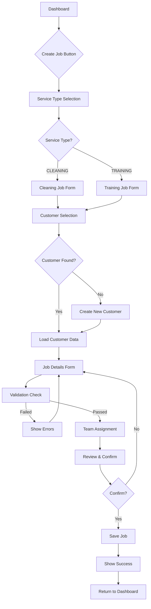
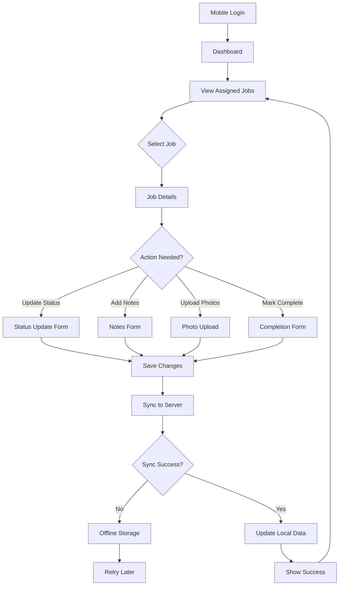
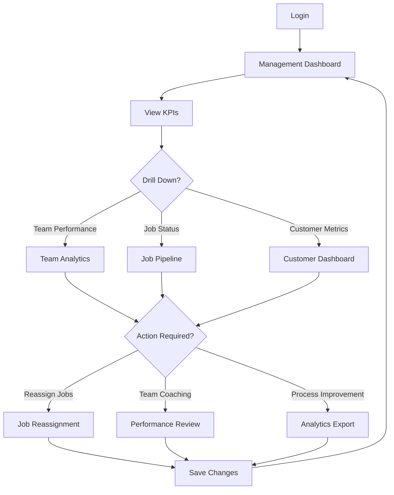

# Epic 2.1: User Flow Diagrams & Detailed Wireframes

## 🔄 Detailed User Flows

### 1. Admin Job Creation Flow



### 2. Operations Team Mobile Flow



### 3. Manager/QC Overview Flow



## 📱 Detailed Mobile Wireframes

### Operations Team Mobile App

#### 1. Login Screen
```
┌─────────────────────┐
│                     │
│       🏢            │
│    Tinedy CRM       │
│                     │
│ ┌─────────────────┐ │
│ │ อีเมล            │ │
│ │ [_______________] │ │
│ └─────────────────┘ │
│                     │
│ ┌─────────────────┐ │
│ │ รหัสผ่าน         │ │
│ │ [_______________] │ │
│ └─────────────────┘ │
│                     │
│ ☑️ จดจำการเข้าสู่ระบบ │
│                     │
│ ┌─────────────────┐ │
│ │   เข้าสู่ระบบ    │ │
│ └─────────────────┘ │
│                     │
│ ลืมรหัสผ่าน?        │
└─────────────────────┘
```

#### 2. Dashboard (Home)
```
┌─────────────────────┐
│ ☰ Tinedy     🔔 3   │ ← Header (notifications)
├─────────────────────┤
│ สวัสดี, สมชาย       │ ← Personal greeting
│ งานวันนี้: 5 งาน     │
├─────────────────────┤
│ 📊 สถิติรวดเร็ว     │ ← Quick stats
│ ✅ เสร็จ: 2  🚀 คาง: 3│
├─────────────────────┤
│ 🚨 ต้องดำเนินการ    │ ← Action items
│ • งานด่วน (1)       │
│ • ใกล้ครบกำหนด (2) │
├─────────────────────┤
│ 📋 งานของฉัน        │ ← My jobs section
│                     │
│ ┌─────────────────┐ │
│ │ 🧹 ทำความสะอาด  │ │ ← Job card
│ │ คุณสมศรี - บ้าน  │ │
│ │ ⏰ 14:00-16:00   │ │
│ │ 📍 ห่าง 2.5 กม.  │ │
│ │ 🟡 กำลังดำเนินการ │ │
│ └─────────────────┘ │
│                     │
│ ┌─────────────────┐ │
│ │ 📚 อบรม         │ │
│ │ บริษัท ABC       │ │
│ │ ⏰ 09:00-12:00   │ │
│ │ 📍 ห่าง 5.8 กม.  │ │
│ │ 🔵 ใหม่          │ │
│ └─────────────────┘ │
│                     │
│ [ ดูทั้งหมด ] ────→ │
└─────────────────────┘
│ [🏠][📋][👥][🔔][👤] │ ← Bottom navigation
└─────────────────────┘
```

#### 3. Job Details Screen
```
┌─────────────────────┐
│ ← งานรายละเอียด   ⋮│ ← Header with menu
├─────────────────────┤
│ 🧹 ทำความสะอาด      │ ← Service type
│ 🟡 กำลังดำเนินการ   │ ← Status badge
├─────────────────────┤
│ 👤 ลูกค้า           │ ← Customer section
│ คุณสมศรี            │
│ 📞 081-234-5678     │
│ 📍 123 ถ.สุขุมวิท    │
│    เขตวัฒนา กทม.    │
├─────────────────────┤
│ 📅 วันที่และเวลา    │ ← Schedule section
│ วันนี้ 15 ต.ค. 2567  │
│ ⏰ 14:00 - 16:00    │
├─────────────────────┤
│ 💰 ราคา: 1,500 บาท  │ ← Price
├─────────────────────┤
│ 📝 หมายเหตุ          │ ← Notes section
│ ทำความสะอาดบ้าน     │
│ 2 ชั้น พื้นที่ 150 ตรม│
├─────────────────────┤
│ 📷 รูปภาพ (2)       │ ← Photos
│ [🖼️] [🖼️] [+]      │
├─────────────────────┤
│ 🔄 อัปเดตสถานะ     │ ← Status update
│ ┌─────────────────┐ │
│ │ ▼ เลือกสถานะ   │ │
│ └─────────────────┘ │
├─────────────────────┤
│ ✏️ เพิ่มหมายเหตุ    │ ← Add notes
│ ┌─────────────────┐ │
│ │                 │ │
│ │                 │ │
│ └─────────────────┘ │
├─────────────────────┤
│ [ 💾 บันทึก ]      │ ← Save button
└─────────────────────┘
```

## 🖥️ Desktop Wireframes

### Admin Dashboard
```
┌─────────────────────────────────────────────────────────────────────────────┐
│ [Logo] Tinedy CRM    [Dashboard][Jobs][Team][Reports][Settings] 🔔 [Profile] │ ← Header
├─────────────────────────────────────────────────────────────────────────────┤
│                                                                             │
│ ┌─────────────────┐ ┌─────────────────┐ ┌─────────────────┐ ┌─────────────┐ │
│ │ 📊 งานทั้งหมด   │ │ ✅ เสร็จสิ้น     │ │ 🚀 กำลังดำเนินการ│ │ ⏰ ค้างชำระ │ │
│ │      125        │ │      89         │ │      28         │ │      8      │ │ ← KPI Cards
│ │   +12% จากเมื่อวาน│ │   +5% จากเมื่อวาน│ │   -2% จากเมื่อวาน│ │   ⚠️ +3    │ │
│ └─────────────────┘ └─────────────────┘ └─────────────────┘ └─────────────┘ │
│                                                                             │
├─────────────────────────────────────────────────────────────────────────────┤
│                                                                             │
│ ┌─────────────────────────────────────────────────────────────────────────┐ │
│ │ 📋 รายการงาน                                      [➕ สร้างงานใหม่] │ │ ← Job List
│ ├─────────────────────────────────────────────────────────────────────────┤ │    Header
│ │ 🔍 [ค้นหางาน...]  [📅 วันที่] [🏷️ ประเภท] [👥 ทีม] [🔄 สถานะ] │ │ ← Filters
│ ├─────────────────────────────────────────────────────────────────────────┤ │
│ │ ID    │ ลูกค้า      │ ประเภท │ วันที่     │ ทีม    │ สถานะ   │ การดำเนินการ│ │ ← Table
│ ├─────────────────────────────────────────────────────────────────────────┤ │    Headers
│ │ #1001 │ คุณสมศรี    │ 🧹     │ 15/10/67  │ ทีม A  │ 🟡 อยู่  │ [👁️][✏️][❌] │ │
│ │ #1002 │ บริษัท ABC  │ 📚     │ 15/10/67  │ ทีม B  │ 🔵 ใหม่  │ [👁️][✏️][❌] │ │ ← Job Rows
│ │ #1003 │ คุณสมชาย    │ 🧹     │ 14/10/67  │ ทีม A  │ ✅ เสร็จ │ [👁️][📋]     │ │
│ │ ...   │ ...         │ ...    │ ...       │ ...    │ ...     │ ...          │ │
│ └─────────────────────────────────────────────────────────────────────────┘ │
│                                                                             │
│ [◀ ก่อนหน้า]                                    [1][2][3]...[10] [ถัดไป ▶] │ ← Pagination
└─────────────────────────────────────────────────────────────────────────────┘
```

### Job Creation Modal/Page
```
┌─────────────────────────────────────────────────────────────────────────────┐
│ ← กลับ                     สร้างงานใหม่                          [💾][❌] │ ← Header
├─────────────────────────────────────────────────────────────────────────────┤
│                                                                             │
│ ┌──────────────────────┐ ┌─────────────────────────────────────────────────┐ │
│ │ 1️⃣ ประเภทบริการ      │ │ 2️⃣ ข้อมูลลูกค้า                              │ │
│ │                      │ │                                                 │ │
│ │ ○ 🧹 ทำความสะอาด     │ │ 🔍 [ค้นหาลูกค้า...]                          │ │
│ │   บ้าน สำนักงาน      │ │                                                 │ │
│ │                      │ │ 📋 ลูกค้าล่าสุด:                               │ │
│ │ ● 📚 อบรม            │ │ • คุณสมศรี (บ้าน)              [เลือก]        │ │
│ │   พนักงาน ทีมงาน     │ │ • บริษัท ABC (สำนักงาน)        [เลือก]        │ │
│ │                      │ │ • คุณสมชาย (คอนโด)             [เลือก]        │ │
│ │ 💡 อบรมการใช้งาน     │ │                                                 │ │
│ │    ระบบ CRM ใหม่     │ │ หรือ [➕ เพิ่มลูกค้าใหม่]                     │ │
│ └──────────────────────┘ └─────────────────────────────────────────────────┘ │
│                                                                             │
│ ┌──────────────────────┐ ┌─────────────────────────────────────────────────┐ │
│ │ 3️⃣ รายละเอียดงาน     │ │ 4️⃣ มอบหมายทีม                               │ │
│ │                      │ │                                                 │ │
│ │ 📅 วันที่: [_______] │ │ 👥 เลือกทีม:                                   │ │
│ │ ⏰ เวลา:  [_______] │ │                                                 │ │
│ │ 💰 ราคา:  [_______] บ│ │ ○ ทีม A (สมชาย, สมศรี) - งาน: 3/5             │ │
│ │                      │ │ ● ทีม B (สุชาติ, สมใจ)  - งาน: 1/5             │ │
│ │ 📝 หมายเหตุ:         │ │ ○ ทีม C (สมหมาย, สมปอง) - งาน: 4/5            │ │
│ │ ┌──────────────────┐ │ │                                                 │ │
│ │ │                  │ │ │ 🎯 แนะนำ: ทีม B (ภาระงานน้อยที่สุด)           │ │
│ │ │                  │ │ │                                                 │ │
│ │ │                  │ │ │ 📍 ใกล้ที่สุด: ทีม A (2.3 กม.)                 │ │
│ │ └──────────────────┘ │ │                                                 │ │
│ └──────────────────────┘ └─────────────────────────────────────────────────┘ │
│                                                                             │
│ ┌─────────────────────────────────────────────────────────────────────────┐ │
│ │ 📋 สรุปข้อมูล                                                           │ │
│ │ ประเภท: 📚 อบรม | ลูกค้า: บริษัท ABC | วันที่: 15/10/67 14:00           │ │
│ │ ทีม: ทีม B (สุชาติ, สมใจ) | ราคา: 3,500 บาท                            │ │
│ └─────────────────────────────────────────────────────────────────────────┘ │
│                                                                             │
│                           [❌ ยกเลิก] [💾 บันทึก]                        │ ← Actions
└─────────────────────────────────────────────────────────────────────────────┘
```

## 🔄 Interactive Prototyping Flows

### Micro-Interactions

#### 1. Status Update Animation
```
Initial State → Loading → Success
┌─────────────┐   ┌─────────────┐   ┌─────────────┐
│ 🟡 กำลังทำ   │ → │ ⏳ อัปเดต... │ → │ ✅ เสร็จสิ้น │
└─────────────┘   └─────────────┘   └─────────────┘
     0.5s              1.0s              2.0s
                   (fade out)       (slide in)
```

#### 2. Job Card Hover States (Desktop)
```
Normal → Hover → Active
┌─────────────┐   ┌─────────────┐   ┌─────────────┐
│ Job Card    │ → │ ↗ Shadow    │ → │ ✓ Selected  │
│ Basic Info  │   │ 📝 Actions  │   │ Highlight   │
└─────────────┘   └─────────────┘   └─────────────┘
```

#### 3. Mobile Pull-to-Refresh
```
Pull Down → Loading → Release → Update
    ↓         ⟲         ↑        ✨
   "Pull"   "Loading"  "Release" "Updated"
```

### Progressive Enhancement Features

#### 1. Smart Auto-Complete
```javascript
// Customer search with intelligent suggestions
const customerSuggestions = {
  recent: [
    { name: "คุณสมศรี", type: "บ้าน", lastService: "2 วันที่แล้ว" },
    { name: "บริษัท ABC", type: "สำนักงาน", lastService: "1 สัปดาห์ที่แล้ว" }
  ],
  nearby: [
    { name: "คุณสมชาย", distance: "2.3 กม.", area: "บางนา" }
  ],
  frequent: [
    { name: "บริษัท XYZ", frequency: "รายเดือน", nextDue: "3 วันข้างหน้า" }
  ]
};
```

#### 2. Context-Aware Defaults
```javascript
// Smart defaults based on service type and customer history
const jobDefaults = {
  CLEANING: {
    duration: "2 hours",
    price: calculateFromArea(),
    team: suggestNearestTeam(),
    tools: ["vacuum", "mop", "cleaning_supplies"]
  },
  TRAINING: {
    duration: "4 hours",
    price: calculateFromParticipants(),
    team: suggestExpertTrainer(),
    materials: ["laptop", "projector", "handouts"]
  }
};
```

#### 3. Offline-First Mobile Experience
```javascript
// Service worker for offline functionality
const offlineCapabilities = {
  viewJobs: "cached data",
  updateStatus: "queue for sync",
  addNotes: "local storage",
  takePhotos: "device storage",
  syncWhenOnline: "background sync"
};
```

## 📊 Component Specifications

### 1. Job Status Component
```css
.job-status {
  display: inline-flex;
  align-items: center;
  gap: 0.5rem;
  padding: 0.25rem 0.75rem;
  border-radius: 1rem;
  font-size: 0.875rem;
  font-weight: 500;
}

.status-new {
  background: #dbeafe;
  color: #1e40af;
}
.status-assigned {
  background: #fef3c7;
  color: #92400e;
}
.status-in-progress {
  background: #d1fae5;
  color: #065f46;
}
.status-completed {
  background: #f3e8ff;
  color: #6b21a8;
}
.status-overdue {
  background: #fee2e2;
  color: #991b1b;
}
```

### 2. Team Workload Indicator
```css
.team-workload {
  display: flex;
  align-items: center;
  gap: 0.5rem;
}

.workload-bar {
  width: 60px;
  height: 8px;
  background: #e5e7eb;
  border-radius: 4px;
  overflow: hidden;
}

.workload-fill {
  height: 100%;
  transition: width 0.3s ease;
}

.workload-low { background: #10b981; }      /* < 50% */
.workload-medium { background: #f59e0b; }   /* 50-80% */
.workload-high { background: #ef4444; }     /* > 80% */
```

### 3. Smart Search Component
```javascript
const SmartSearch = {
  props: {
    placeholder: "ค้นหาลูกค้า งาน หรือทีม...",
    suggestions: Array,
    onSearch: Function,
    recentSearches: Array
  },
  features: {
    debounce: 300, // ms
    minCharacters: 2,
    maxSuggestions: 8,
    categorizedResults: true,
    keyboardNavigation: true
  }
};
```

---

## 🎯 Implementation Priority

### Phase 1: Core Mobile Experience (Week 1-2)
1. Mobile login and dashboard
2. Job list with basic filtering
3. Job detail view with status updates
4. Basic photo upload

### Phase 2: Desktop Admin Interface (Week 3-4)
1. Admin dashboard with KPIs
2. Job creation wizard
3. Team management interface
4. Bulk operations

### Phase 3: Advanced Features (Week 5-6)
1. Smart search and auto-complete
2. Offline functionality
3. Advanced analytics
4. Performance optimizations

### Phase 4: Polish & Testing (Week 7-8)
1. Micro-interactions and animations
2. Accessibility enhancements
3. Performance tuning
4. User testing and feedback integration

ไฟล์นี้จะใช้ร่วมกับ Epic 2.1 UX/UI Design Specifications เพื่อให้ทีมพัฒนามีข้อมูลครบถ้วนสำหรับการสร้าง interface ที่มีประสิทธิภาพและใช้งานง่าย